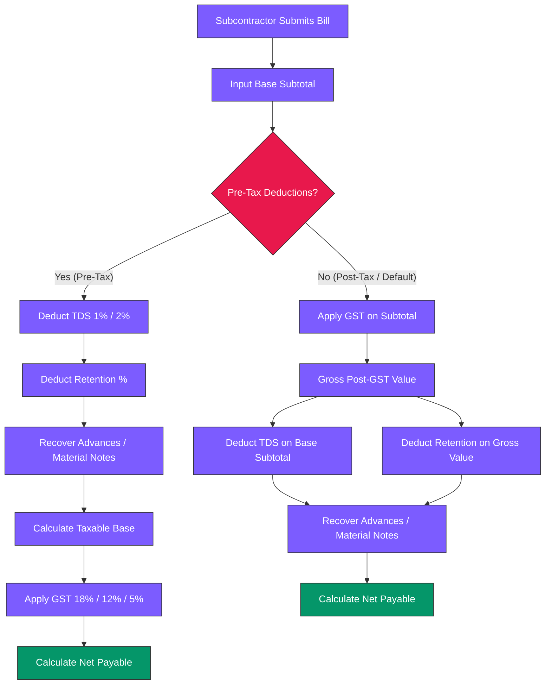

# SiteFlow — Premium Construction Management ERP Platform

SiteFlow is an enterprise-grade, highly secure, and visually stunning Construction Management ERP Platform designed for developers, builders, contractors, architects, infrastructure firms, and project management consultancies (PMC).

By replacing scattered spreadsheets, paper registers, and untracked messaging with a unified real-time workspace, SiteFlow provides absolute visibility over budgets, schedule timelines, procurement workflows, labor attendance, and subcontractor billing.

---

## 📊 System Architecture & Data Flow

SiteFlow synchronizes field operations with back-office accounting systems (Tally Prime, Zoho Books) via a robust PostgreSQL datastore and FastAPI calculation core:

```mermaid
graph TD
    subgraph Jobsite (Mobile PWA)
        A1[GPS Geofenced Punch-in] --> B1[Local DB Backup / Sync]
        A2[Daily Progress Photos] --> B1
        A3[Material Receipts / GRN] --> B1
    end

    subgraph SiteFlow Core Engine (Backend FastAPI)
        B1 -- REST API HTTPS --> C1[API Router Gateway]
        C1 --> C2[Math Engine / IS 456]
        C1 --> C3[Deduction & Tax Engine]
        C1 --> C4[PostGIS Geofence Validator]
    end

    subgraph Data Store (Supabase PostgreSQL)
        C2 --> D1[(Company & Project Tables)]
        C3 --> D1
        C4 --> D2[(Geofenced Coordinates)]
    end

    subgraph ERP Integration & Analytics
        D1 --> E1[Tally Prime Desktop Sync]
        D1 --> E2[Zoho Books Sync]
        D1 --> E3[Executive Analytics Dashboard]
    end

    classDef site fill:#E8184C,stroke:#333,stroke-width:2px,color:#fff;
    classDef core fill:#7C5CFF,stroke:#333,stroke-width:2px,color:#fff;
    classDef db fill:#171520,stroke:#555,stroke-width:2px,color:#fff;
    classDef integrations fill:#0B0910,stroke:#E8184C,stroke-width:1px,color:#ededed;
    
    class A1,A2,A3,B1 site;
    class C1,C2,C3,C4 core;
    class D1,D2 db;
    class E1,E2,E3 integrations;
```

---

## 🧮 Industry-Specific Construction Engineering Formulas & Processes

SiteFlow embeds standardized civil engineering codes, CPWD specifications, and Indian statutory tax rules within its calculation core.

### 1. Concrete Mix & Material Estimation (IS 456:2000)
To convert wet concrete volume into the raw materials (cement, sand, aggregate) required, SiteFlow uses a dry volume conversion factor of **$1.54$** (to account for voids and shrinkage during wet mixing):
$$\text{Dry Volume} = \text{Wet Volume} \times 1.54$$

Material breakdowns are computed based on standard nominal mix ratios (Cement : Sand : Coarse Aggregate) specified under **CPWD Standards**:
* **M5 (1:5:10)** | **M7.5 (1:4:8)** | **M10 (1:3:6)** | **M15 (1:2:4)** | **M20 (1:1.5:3)** | **M25 (1:1:2)**

#### Material Quantification Formulas:
* **Cement Bags** (assuming $50\text{ kg}$ per bag, density of $1440\text{ kg/m}^3$, corresponding to volume $0.0347\text{ m}^3$):
  $$\text{Cement (bags)} = \frac{\text{Dry Volume} \times \text{Cement Ratio}}{\text{Sum of Mix Ratios} \times 0.0347}$$
* **Sand Volume ($m^3$):**
  $$\text{Sand Volume} = \frac{\text{Dry Volume} \times \text{Sand Ratio}}{\text{Sum of Mix Ratios}}$$
* **Coarse Aggregate Volume ($m^3$):**
  $$\text{Aggregate Volume} = \frac{\text{Dry Volume} \times \text{Coarse Aggregate Ratio}}{\text{Sum of Mix Ratios}}$$

---

### 2. TMT Rebar Structural Weight Calculation (IS 1786)
Reinforcement steel rebar weight is estimated using nominal diameters according to the Indian Standard unit weight formula:
$$w = \frac{d^2}{162.2} \text{ kg/m}$$
*Where $d$ is the rebar diameter in millimeters.*

Total weight (including lap length and waste margins) is computed as:
$$W_{\text{total}} = \sum \left( L_i \times N_i \times \frac{d_i^2}{162.2} \right) \times (1 + \text{Wastage Pct})$$
*Where $L_i$ is the length of bar $i$ in meters, and $N_i$ is the count of bars.*

---

### 3. Subcontractor Billing Tax Deduction Engine
Subcontractor Running Account (RA) bills are calculated under two distinct prioritization sequences depending on the Works Contract terms:



#### Formula Case A: Pre-Tax Deductions (TDS & Retention on Base)
Under this mode, security deductions and tax withholdings are subtracted to establish a net taxable base *prior* to applying GST (often used when subcontractors supply raw materials subject to offset):
1. **TDS Withholding** (Section 194C / 194Q): $\text{TDS} = S \times \text{TDS Pct}$ (e.g., 2% for Corporate, 1% for Individual).
2. **Retention Money**: $\text{Retention} = S \times \text{Retention Pct}$ (e.g., 5% held as security deposit).
3. **Net Taxable Base**: $TB = S - \text{TDS} - \text{Retention} - A$ (where $A$ is the mobilization advance recovery).
4. **GST Amount**: $\text{GST} = TB \times \text{GST Pct}$ (typically 18% for Works Contract).
5. **Net Payable**: $\text{Net Payable} = TB + \text{GST}$.

#### Formula Case B: Post-Tax Deductions (Standard Indian Works Contract)
GST is calculated on the raw subtotal first, and deductions are calculated on their respective base values before being subtracted:
1. **GST Amount**: $\text{GST} = S \times \text{GST Pct}$ (applied on raw base subtotal).
2. **Gross Bill Total**: $G = S + \text{GST}$.
3. **TDS Withholding**: $\text{TDS} = S \times \text{TDS Pct}$ (calculated on base subtotal).
4. **Retention Money**: $\text{Retention} = G \times \text{Retention Pct}$ (calculated on gross post-GST total).
5. **Net Payable**: $\text{Net Payable} = G - \text{TDS} - \text{Retention} - A$.

---

### 4. Planning & Scheduling Critical Path Method (CPM)
For WBS task networks, SiteFlow computes the schedule passes to define task floats and establish the critical path:
* **Early Finish (EF):** $\text{EF} = \text{Early Start (ES)} + \text{Duration}$
* **Late Start (LS):** $\text{LS} = \text{Late Finish (LF)} - \text{Duration}$
* **Total Float (TF):** $\text{TF} = \text{LF} - \text{EF} = \text{LS} - \text{ES}$

*Tasks with $\text{Total Float} = 0$ are designated as Critical Path tasks, meaning any delay in their execution directly pushes back the final project completion date.*

---

## 🎨 Premium UI/UX & Design Philosophy

SiteFlow features a state-of-the-art **glassmorphic dark-mode canvas** optimized for long hours of office operations:
* **Background Canvas**: `#0E0C15` (Deep space slate-black)
* **Card Containers**: `#171520` with borders of `rgba(255, 255, 255, 0.06)` and `backdrop-filter: blur(12px)`
* **Active Highlights**: `#E8184C` (Hot pink / crimson for active indicators and CTAs)
* **Secondary Highlights**: `#7C5CFF` (Interactive purple for sub-elements and navigation tabs)
* **Typography**: Clean, editorial-style **Inter** font with tight letter spacing for high data readability.

---

## 📂 Project Directory Structure

* [context/](file:///C:/Users/Dell/Github/Construction-Management-ERP-Software/context/) — Session context, roadmap history, audits, calculators, and reverse-engineering notes.
* [onsiteteams-recon/](file:///C:/Users/Dell/Github/Construction-Management-ERP-Software/onsiteteams-recon/) — Raw competitor bundle resources, HTML assets, sitemaps, and API schemas.
* [frontend/](file:///C:/Users/Dell/Github/Construction-Management-ERP-Software/frontend/) — Next.js app-router frontend, including dashboard, project modules, analytics, and PWA shell assets.
* [backend/](file:///C:/Users/Dell/Github/Construction-Management-ERP-Software/backend/) — FastAPI backend with routers for auth, calculators, planning, procurement, billing, HR, quality, reports, equipment, safety, analytics, and production.

---

## 📍 In-Depth Subpage & Feature Map

### 1. Executive Analytics (`/c/[company_id]/analytics`)
- **Interactive S-Curve Chart**: Renders planned progress vs. actual progress using SVG coordinates. Hovering on coordinates displays a glassmorphic tooltip with planned %, actual %, and variance calculations.
- **Interactive Budget Burn Chart**: Plots cumulative spend against total project budget. Hovering displays the exact burn share percentage and Rupees (INR) spent.
- **Project Scoreboard**: Live comparison table detailing project budget, cumulative spend, completion status, and active tasks.

### 2. Project Modules (`/c/[company_id]/p/[project_id]/`)
- **Attendance & Payroll (`/attendance`)**:
  - GPS-tagged punch-in / punch-out geofencing with local storage backup.
  - Localization support for **English**, **Hinglish**, **Hindi**, and **Tamil** for site staff.
  - Multi-level shift calculations (0.25, 0.50, 0.75, 1.00 shifts) and overtime hours.
- **Subcontractor Billing (`/billing`)**:
  - Live billing calculator preview supporting pre-tax and post-tax deductions.
  - Indian taxation presets: **GST** (18% Works Contract, 12% Infra, 5% Housing) and **TDS** (1% Section 194C Individual, 2% Section 194C Corporate, 0.1% Section 194Q).
  - Debit/Credit Notes Ledger for material recovery deductions.
- **Planning & Gantt (`/planning/gantt`)**:
  - Interactive Gantt chart schedule viewer with critical path tracking.
- **CRM (`/crm`)**: Lead management, client contacts, and quotation templates (Villa vs. Commercial).
- **DPR (`/dpr`)**: Daily progress reporting, delay tracking, and supervisor photo attachments.
- **Drawings (`/drawings`)**: Version-controlled construction blueprint registry.
- **Equipment (`/equipment`)**: Heavy machinery (Excavators, Transit Mixers) fuel logs and run hours.
- **Finance (`/finance`)**: Cash flow projections, petty cash receipts, and supplier ledgers.
- **HR (`/hr`)**: Site staff salary payouts, advance register, and role assignments.
- **Procurement (`/procurement`)**: Material indents, Purchase Orders (PO), and Goods Receipt Notes (GRN) with approval gates.
- **Production (`/production`)**: Task-level work quantities (masonry, tiling, concrete).
- **Quality (`/quality`)**: Concrete slump test logs, cube strength registers, and checklists.
- **Reports (`/reports`)**: Auto-generated PDF/Excel summaries of material waste, daily reports, and labor.
- **Safety (`/safety`)**: Site hazard reporting, PPE audit checklists, and toolbox talk logs.

### 3. Public Website Integrations Hub (`/integrations`)
- Interactive search engine and category selector pills (Accounting, Communication, Storage, Analytics, Field & Site).
- Full active configuration panel for **Tally ERP** link, and request forms for planned modules (WhatsApp Business, Zoho, QuickBooks, Google Drive).

---

## 🔒 Multi-Tenant Data Security & Isolation

SiteFlow is built from the ground up for strict multi-tenant isolation:
* **Direct Company Linkage**: All transactional tables carry `company_id` columns with foreign keys referencing `companies(id) ON DELETE CASCADE`.
* **Company-Scoped Unique Keys**: Numbers like PO, GRN, and Indents are unique *only within the company context* (`UNIQUE(company_id, po_number)`), permitting standard sequence numbering (e.g. `PO-001`) to coexist across separate tenants.
* **Client Invoice Integrity**: Unique partial indices are enforced on outgoing client tax invoices to prevent duplicate numbers:
  ```sql
  CREATE UNIQUE INDEX unique_sale_invoice_number_per_company 
  ON bills (company_id, invoice_number) 
  WHERE invoice_type = 'sale';
  ```

---

## ⚡ Setup & Local Running Instructions

### 1. Environment Configurations
Copy the `.env.example` file to `.env` in the root folder and configure the connection parameters:
```bash
cp .env.example .env
```
Ensure the following variables are specified:
* `DATABASE_URL`: PostgreSQL connection string.
* `SUPABASE_URL`: Supabase project URL endpoint.
* `SUPABASE_ANON_KEY`: Supabase Client Anonymous API key.

### 2. Database Migrations
Deploy the PostgreSQL schema script directly to your Supabase SQL Editor:
```bash
# Run migrations using Supabase CLI
supabase db push
```

### 3. Start Development Servers
```bash
# Start frontend Next.js server
cd frontend
npm install
npm run dev

# Start backend FastAPI server
cd backend
pip install -r requirements.txt
python -m uvicorn main:app --reload
```
