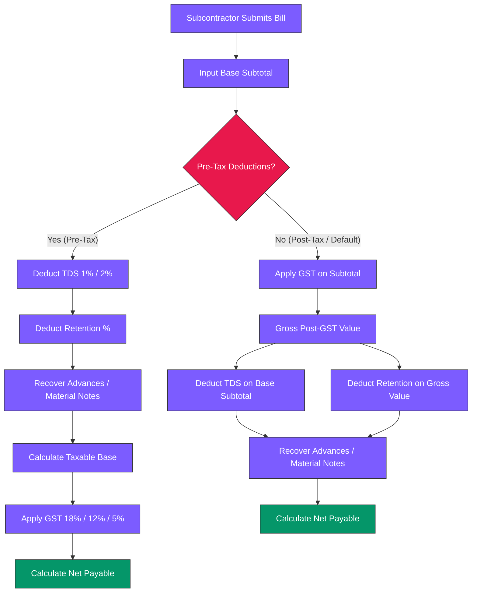

# SiteFlow — Premium Construction Management ERP Platform

SiteFlow is a world-class, highly secure, and visually stunning Construction Management ERP Platform designed for developers, builders, contractors, architects, infrastructure firms, and interior design companies. 

By replacing scattered Excel sheets, manual paper registers, and WhatsApp threads with a single unified workspace, SiteFlow provides absolute visibility over budgets, progress tracking, procurement, labor attendance, and subcontractor billing.

---

## 📊 System Architecture & Data Flow

Below is a detailed graph showing how data flows from site personnel (geofenced mobile apps) to office personnel (executive analytics) and accounts sync services:

```mermaid
graph TD
    subgraph Jobsite (Mobile PWA)
        A1[GPS Geofenced Punch-in] --> B1[Local DB Backup / Sync]
        A2[Daily Progress Photos] --> B1
        A3[Material Receipts / GRN] --> B1
    end

    subgraph SiteFlow Core Engine (Backend FastAPI)
        B1 -- REST API HTTPS --> C1[API Router Gateway]
        C1 --> C2[Math Engine / IS 456]
        C1 --> C3[Deduction & Tax Engine]
        C1 --> C4[PostGIS Geofence Validator]
    end

    subgraph Data Store (Supabase PostgreSQL)
        C2 --> D1[(Company & Project Tables)]
        C3 --> D1
        C4 --> D2[(Geofenced Coordinates)]
    end

    subgraph ERP Integration & Analytics
        D1 --> E1[Tally Prime Desktop Sync]
        D1 --> E2[Zoho Books Sync]
        D1 --> E3[Executive Analytics Dashboard]
    end

    classDef site fill:#E8184C,stroke:#333,stroke-width:2px,color:#fff;
    classDef core fill:#7C5CFF,stroke:#333,stroke-width:2px,color:#fff;
    classDef db fill:#171520,stroke:#555,stroke-width:2px,color:#fff;
    classDef integrations fill:#0B0910,stroke:#E8184C,stroke-width:1px,color:#ededed;
    
    class A1,A2,A3,B1 site;
    class C1,C2,C3,C4 core;
    class D1,D2 db;
    class E1,E2,E3 integrations;
```

---

## 🧮 Subcontractor Billing & Deductions Flow Chart

SiteFlow implements a robust financial engine to compute subcontractor RA bills, applying GST and TDS (Section 194C/194Q) with custom tax deduction sequencing:



---

## 🎨 Premium UI/UX & Design Philosophy
SiteFlow features a state-of-the-art **glassmorphic dark-mode canvas** optimized for long hours of office operations:
* **Background Canvas**: `#0E0C15` (Deep space slate-black)
* **Card Containers**: `#171520` with borders of `rgba(255, 255, 255, 0.06)` and `backdrop-filter: blur(12px)`
* **Active Highlight**: `#E8184C` (Hot pink / crimson for active indicators and CTAs)
* **Secondary Highlight**: `#7C5CFF` (Interactive purple for sub-elements and navigation tabs)
* **Typography**: Clean, editorial-style **Inter** font with tight letter spacing for high data readability.

---

## 📂 Project Directory Structure
* `context/`: Session context, roadmap history, audits, calculators, and reverse-engineering notes.
* `onsiteteams-recon/`: Raw competitor bundle resources, HTML assets, sitemaps, and API schemas.
* `frontend/`: Next.js app-router frontend, including dashboard, project modules, analytics, and PWA shell assets.
* `backend/`: FastAPI backend with routers for auth, calculators, planning, procurement, billing, HR, quality, reports, equipment, safety, analytics, and production.

---

## 📍 In-Depth Subpage & Feature Map

### 1. Executive Analytics (`/c/[company_id]/analytics`)
- **Interactive S-Curve Chart**: Renders planned progress vs. actual progress using SVG coordinates. Hovering on coordinates displays a glassmorphic tooltip with planned %, actual %, and variance calculations.
- **Interactive Budget Burn Chart**: Plots cumulative spend against total project budget. Hovering displays the exact burn share percentage and Rupees (INR) spent.
- **Project Scoreboard**: Live comparison table detailing project budget, cumulative spend, completion status, and active tasks.

### 2. Project Modules (`/c/[company_id]/p/[project_id]/`)
- **Attendance & Payroll (`/attendance`)**:
  - GPS-tagged punch-in / punch-out geofencing with local storage backup.
  - Localization support for **English**, **Hinglish**, **Hindi**, and **Tamil** for site staff.
  - Multi-level shift calculations (0.25, 0.50, 0.75, 1.00 shifts) and overtime hours.
- **Subcontractor Billing (`/billing`)**:
  - Live billing calculator preview supporting pre-tax and post-tax deductions.
  - Indian taxation presets: **GST** (18% Works Contract, 12% Infra, 5% Housing) and **TDS** (1% Section 194C Individual, 2% Section 194C Corporate, 0.1% Section 194Q).
  - Debit/Credit Notes Ledger for material recovery deductions.
- **Planning & Gantt (`/planning/gantt`)**:
  - Interactive Gantt chart schedule viewer with critical path tracking.
- **CRM (`/crm`)**: Lead management, client contacts, and quotation templates (Villa vs. Commercial).
- **DPR (`/dpr`)**: Daily progress reporting, delay tracking, and supervisor photo attachments.
- **Drawings (`/drawings`)**: Version-controlled construction blueprint registry.
- **Equipment (`/equipment`)**: Heavy machinery (Excavators, Transit Mixers) fuel logs and run hours.
- **Finance (`/finance`)**: Cash flow projections, petty cash receipts, and supplier ledgers.
- **HR (`/hr`)**: Site staff salary payouts, advance register, and role assignments.
- **Procurement (`/procurement`)**: Material indents, Purchase Orders (PO), and Goods Receipt Notes (GRN) with approval gates.
- **Production (`/production`)**: Task-level work quantities (masonry, tiling, concrete).
- **Quality (`/quality`)**: Concrete slump test logs, cube strength registers, and checklists.
- **Reports (`/reports`)**: Auto-generated PDF/Excel summaries of material waste, daily reports, and labor.
- **Safety (`/safety`)**: Site hazard reporting, PPE audit checklists, and toolbox talk logs.

### 3. Public Website Integrations Hub (`/integrations`)
- Interactive search engine and category selector pills (Accounting, Communication, Storage, Analytics, Field & Site).
- Full active configuration panel for **Tally ERP** link, and request forms for planned modules (WhatsApp Business, Zoho, QuickBooks, Google Drive).

---

## 🔒 Multi-Tenant Data Security & Isolation
SiteFlow is built from the ground up for strict multi-tenant isolation:
* **Direct Company Linkage**: All transactional tables (`purchase_orders`, `material_indents`, `goods_receipt_notes`, `work_orders`, `equipment_registry`, `bills`) carry `company_id` columns with foreign keys referencing `companies(id) ON DELETE CASCADE`.
* **Company-Scoped Unique Keys**: Numbers like PO, GRN, and Indents are unique *only within the company context* (`UNIQUE(company_id, po_number)`), permitting standard sequence numbering (e.g. `PO-001`) to coexist across separate tenants.
* **Client Invoice Integrity**: Unique partial indices are enforced on outgoing client tax invoices to prevent duplicate numbers:
  ```sql
  CREATE UNIQUE INDEX unique_sale_invoice_number_per_company 
  ON bills (company_id, invoice_number) 
  WHERE invoice_type = 'sale';
  ```

---

## 🧼 Competitor Content Cleansing & Git Scrubbing
To ensure all competitor metadata has been removed:
1. **Name scrubbing**: All Indian personal names, client companies, and project identifiers originally referenced on competitor materials were scrubbed from code comments, blog databases, and help documentation.
2. **Git History Purge**: Re-written using `git-filter-repo` to permanently eliminate personal and competitor references from previous commits:
   ```bash
   git filter-repo --force --replace-text <git_replacements.txt>
   ```

---

## ⚡ Setup & Local Running Instructions

### 1. Environment Configurations
Copy the `.env.example` file to `.env` in the root folder and configure the connection parameters:
```bash
cp .env.example .env
```
Ensure the following variables are specified:
* `DATABASE_URL`: PostgreSQL connection string.
* `SUPABASE_URL`: Supabase project URL endpoint.
* `SUPABASE_ANON_KEY`: Supabase Client Anonymous API key.

### 2. Database Migrations
Deploy the PostgreSQL schema script directly to your Supabase SQL Editor:
```bash
# Run migrations using Supabase CLI
supabase db push
```

### 3. Start Development Servers
```bash
# Start frontend Next.js server
cd frontend
npm install
npm run dev

# Start backend FastAPI server
cd backend
pip install -r requirements.txt
uvicorn main:app --reload
```
