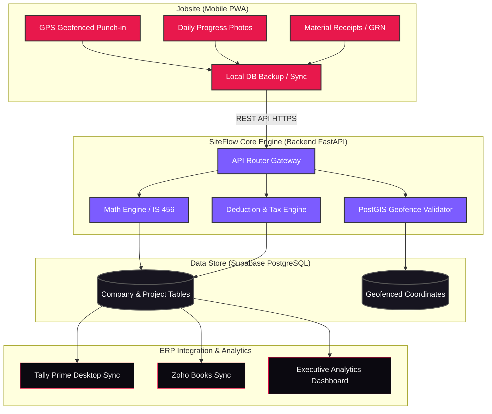
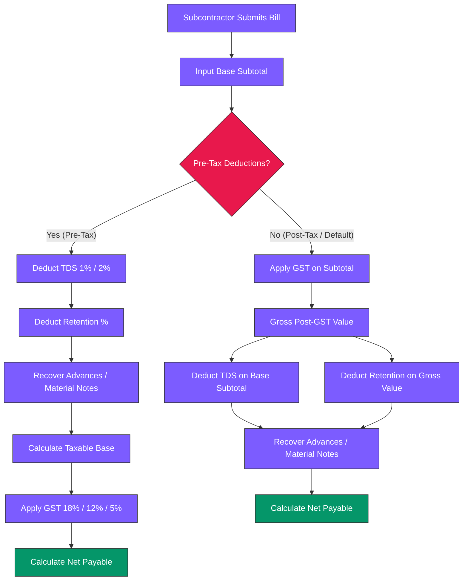

<p align="center">
  
</p>

<p align="center">
  <a href="https://github.com/yieldchaser/Construction-Management-ERP-Software/blob/main/LICENSE"></a>
  <a href="https://construction-management-erp-softwar-ten.vercel.app"></a>
  <a href="https://construction-erp-backend-73vm.onrender.com"></a>
  
  
</p>

<p align="center">
  
  
  
  
  
</p>

<p align="center"><em>SiteFlow is the premium, enterprise-grade Construction Management ERP designed specifically for developers, builders, contractors, and project management consultancies.</em></p>

---

## Overview

SiteFlow is an outcome-driven, high-fidelity ERP workspace tailored to the Indian construction industry. By consolidating scattered Excel sheets, manual site registers, and geofenced field operations into a single real-time glassmorphic canvas, SiteFlow delivers absolute control over engineering BOQ spreadsheets, subcontractor RA billing math, CPWD-compliant material estimation, purchase order workflows, and executive schedule timelines. It integrates directly with Tally Prime and Zoho Books ledger cards to automate back-office reconciliation.

---

## Key Features

* **🧮 Interactive Subcontractor Billing**: Real-time invoice calculators supporting pre-tax and post-tax works contract deduction configurations with automatic Indian GST and TDS presets.
* **📍 Geofenced Mobile PWA Attendance**: GPS geofencing utilizing Haversine coordinate validation with Hinglish/Tamil localization and offline local storage backup for field workers.
* **📅 WBS Gantt Timelines**: Forward-pass Critical Path Method (CPM) scheduler calculating early/late starts, finishes, and total task floats with circular dependency protection.
* **📦 CPWD Material Quantification**: Built-in concrete mix estimators (IS 456), rebar reinforcement steel weight calculators (IS 1786), brick masonry logs, and wall paint area estimators.
* **🔒 Multi-Tenant Data Isolation**: Direct row-level security and company-scoped keys ensuring strict data division between tenants while permitting overlapping sequence numbers.

---

## 📊 System Architecture & Data Flow

SiteFlow maps jobsite inputs (materials, attendance, progress photos) directly to core calculation engines and accounting records:



---

## 🧮 Industry-Specific Construction Engineering Formulas & Processes

SiteFlow embeds standardized civil engineering codes, CPWD specifications, and Indian statutory tax rules within its calculation core.

### 1. Concrete Mix & Material Estimation (IS 456:2000)
To convert wet concrete volume into raw material quantities, SiteFlow applies a dry volume conversion factor of **$1.54$** to account for void ratios and mixing shrinkage:
$$\text{Dry Volume} = \text{Wet Volume} \times 1.54$$

Quantification breaks down cement, sand, and coarse aggregates using CPWD-compliant mix ratios:
* **M5 (1:5:10)** | **M7.5 (1:4:8)** | **M10 (1:3:6)** | **M15 (1:2:4)** | **M20 (1:1.5:3)** | **M25 (1:1:2)**

$$\text{Cement (bags)} = \frac{\text{Dry Volume} \times \text{Cement Ratio}}{\text{Sum of Mix Ratios} \times 0.0347 \text{ m}^3\text{/bag}}$$
$$\text{Sand Volume } (m^3) = \frac{\text{Dry Volume} \times \text{Sand Ratio}}{\text{Sum of Mix Ratios}}$$
$$\text{Coarse Aggregate Volume } (m^3) = \frac{\text{Dry Volume} \times \text{Coarse Aggregate Ratio}}{\text{Sum of Mix Ratios}}$$

---

### 2. TMT Rebar Weight Calculations (IS 1786)
Reinforcement steel rebar weight is calculated using standard nominal diameters according to the Indian Standard unit weight formula:
$$w = \frac{d^2}{162.2} \text{ kg/m}$$
*Where $d$ is the rebar diameter in millimeters.*

Total reinforcement requirements (incorporating lap length and waste multipliers) are calculated as:
$$W_{\text{total}} = \sum \left( L_i \times N_i \times \frac{d_i^2}{162.2} \right) \times (1 + \text{Wastage Pct})$$

---

### 3. Subcontractor Billing Tax Deduction Engine
SiteFlow computes subcontractor Running Account (RA) bills according to two distinct prioritization structures depending on contract terms:



#### Pre-Tax Deductions (TDS & Retention on Base)
TDS and security retentions are subtracted *before* applying GST (applicable when subcontractor materials are offset):
1. **TDS Withholding**: $\text{TDS} = S \times \text{TDS Pct}$ (e.g. Section 194C 1% or 2%).
2. **Retention Money**: $\text{Retention} = S \times \text{Retention Pct}$.
3. **Net Taxable Base**: $TB = S - \text{TDS} - \text{Retention} - A$ (where $A$ is the advance recovery).
4. **GST Amount**: $\text{GST} = TB \times \text{GST Pct}$ (Works Contract 18%).
5. **Net Payable**: $\text{Net Payable} = TB + \text{GST}$.

#### Post-Tax Deductions (Standard Works Contract)
GST is applied directly to the base subtotal, and deductions are subtracted from the gross total:
1. **GST Amount**: $\text{GST} = S \times \text{GST Pct}$.
2. **Gross Bill Total**: $G = S + \text{GST}$.
3. **TDS Withholding**: $\text{TDS} = S \times \text{TDS Pct}$.
4. **Retention Money**: $\text{Retention} = G \times \text{Retention Pct}$.
5. **Net Payable**: $\text{Net Payable} = G - \text{TDS} - \text{Retention} - A$.

---

### 4. Planning & Scheduling Critical Path Method (CPM)
Task timelines calculate network floats to isolate schedule risks:
* **Early Finish (EF):** $\text{EF} = \text{Early Start (ES)} + \text{Duration}$
* **Late Start (LS):** $\text{LS} = \text{Late Finish (LF)} - \text{Duration}$
* **Total Float (TF):** $\text{TF} = \text{LF} - \text{EF} = \text{LS} - \text{ES}$

*Tasks with $\text{Total Float} = 0$ represent the Critical Path; any delay to these tasks directly impacts the project completion date.*

---

### 5. Brick & Block Masonry Quantity Estimator (CPWD)
* **Modular brick size**: $190 \times 90 \times 90\text{ mm}$ (Nominal size with mortar: $200 \times 100 \times 100\text{ mm}$).
* **Standard brick constant**: $500\text{ bricks per } m^3$ of masonry wall.
* **Dry Mortar volume factor**: $1.33$ (shrinkage & joint waste multiplier).
* **Mortar wet volume fraction**: Typically $30\%$ of total wall masonry volume.

$$\text{Total Brick Count } (N) = \text{Wall Length} \times \text{Wall Height} \times \text{Wall Thickness} \times 500$$
$$V_{\text{dry}} = (\text{Wall Length} \times \text{Wall Height} \times \text{Wall Thickness}) \times 0.30 \times 1.33$$
$$\text{Cement (bags)} = \frac{V_{\text{dry}} \times \text{Cement Ratio}}{\text{Sum of Mix Ratios} \times 0.0347}$$
$$\text{Sand Volume } (m^3) = \frac{V_{\text{dry}} \times \text{Sand Ratio}}{\text{Sum of Mix Ratios}}$$

---

### 6. Paint & Wall Coverage Quantification
$$\text{Paint Volume (liters)} = \frac{\text{Wall Surface Area} \times \text{Number of Coats}}{\text{Single Coat Coverage Rate} \times \text{Absorption Factor}}$$

---

### 7. Geofenced Site Labor Shift & Attendance Payroll Math
* **Haversine Distance**: $d \le R_{\text{geofence}}$ is verified.
* **Shift Multipliers**: Standard shift fractions ($0.25, 0.50, 0.75, 1.00, 1.25$ shifts).

$$\text{Daily Labor Compensation} = (\text{Daily Wage} \times \text{Shift Multiplier}) + (\text{Overtime Hours} \times \text{Hourly OT Rate}) + \text{Allowances} - \text{Deductions}$$

---

### 8. Heavy Equipment Fuel Consumption & Utilization Math
$$R_{\text{fuel}} = \frac{\text{Fuel Consumed (liters)}}{\text{Final Run Hours} - \text{Initial Run Hours}}$$
$$\text{Utilization Pct} = \frac{\text{Working Hours}}{\text{Total Available Shift Hours}} \times 100$$

---

### 9. Compressive Cube Strength Compliance (IS 516 / IS 456)
$$f_c = \frac{\text{Peak Failure Load (N)}}{\text{Cube Area } (150 \times 150 \text{ mm}^2)} = \frac{P}{22500}$$
* **7-Day Compliance Check**: Compressive strength $f_c \ge 0.65 \times f_{ck}$.
* **28-Day Compliance Check**: Compressive strength $f_c \ge 1.00 \times f_{ck}$.

---

## 🎨 Premium UI/UX & Design Philosophy

SiteFlow features a state-of-the-art **glassmorphic dark-mode canvas** optimized for long hours of office operations:
* **Background Canvas**: `#0E0C15` (Deep space slate-black)
* **Card Containers**: `#171520` with borders of `rgba(255, 255, 255, 0.06)` and `backdrop-filter: blur(12px)`
* **Active Highlights**: `#E8184C` (Hot pink / crimson for active indicators and CTAs)
* **Secondary Highlights**: `#7C5CFF` (Interactive purple for sub-elements and navigation tabs)
* **Typography**: Clean, editorial-style **Inter** font with tight letter spacing for high data readability.

---

## 📂 Project Directory Structure

* [context/](file:///C:/Users/Dell/Github/Construction-Management-ERP-Software/context/) — Session context, roadmap history, audits, calculators, and reverse-engineering notes.
* [onsiteteams-recon/](file:///C:/Users/Dell/Github/Construction-Management-ERP-Software/onsiteteams-recon/) — Raw competitor bundle resources, HTML assets, sitemaps, and API schemas.
* [frontend/](file:///C:/Users/Dell/Github/Construction-Management-ERP-Software/frontend/) — Next.js app-router frontend, including dashboard, project modules, analytics, and PWA shell assets.
* [backend/](file:///C:/Users/Dell/Github/Construction-Management-ERP-Software/backend/) — FastAPI backend with routers for auth, calculators, planning, procurement, billing, HR, quality, reports, equipment, safety, analytics, and production.

---

## 📍 In-Depth Subpage & Feature Map

### 1. Executive Analytics (`/c/[company_id]/analytics`)
- **Interactive S-Curve Chart**: Renders planned progress vs. actual progress using SVG coordinates. Hovering on coordinates displays a glassmorphic tooltip with planned %, actual %, and variance calculations.
- **Interactive Budget Burn Chart**: Plots cumulative spend against total project budget. Hovering displays the exact burn share percentage and Rupees (INR) spent.
- **Project Scoreboard**: Live comparison table detailing project budget, cumulative spend, completion status, and active tasks.

### 2. Project Modules (`/c/[company_id]/p/[project_id]/`)
- **Attendance & Payroll (`/attendance`)**:
  - GPS-tagged punch-in / punch-out geofencing with local storage backup.
  - Localization support for **English**, **Hinglish**, **Hindi**, and **Tamil** for site staff.
  - Multi-level shift calculations (0.25, 0.50, 0.75, 1.00 shifts) and overtime hours.
- **Subcontractor Billing (`/billing`)**:
  - Live billing calculator preview supporting pre-tax and post-tax deductions.
  - Indian taxation presets: **GST** (18% Works Contract, 12% Infra, 5% Housing) and **TDS** (1% Section 194C Individual, 2% Section 194C Corporate, 0.1% Section 194Q).
  - Debit/Credit Notes Ledger for material recovery deductions.
- **Planning & Gantt (`/planning/gantt`)**:
  - Interactive Gantt chart schedule viewer with critical path tracking.
- **CRM (`/crm`)**: Lead management, client contacts, and quotation templates (Villa vs. Commercial).
- **DPR (`/dpr`)**: Daily progress reporting, delay tracking, and supervisor photo attachments.
- **Drawings (`/drawings`)**: Version-controlled construction blueprint registry.
- **Equipment (`/equipment`)**: Heavy machinery (Excavators, Transit Mixers) fuel logs and run hours.
- **Finance (`/finance`)**: Cash flow projections, petty cash receipts, and supplier ledgers.
- **HR (`/hr`)**: Site staff salary payouts, advance register, and role assignments.
- **Procurement (`/procurement`)**: Material indents, Purchase Orders (PO), and Goods Receipt Notes (GRN) with approval gates.
- **Production (`/production`)**: Task-level work quantities (masonry, tiling, concrete).
- **Quality (`/quality`)**: Concrete slump test logs, cube strength registers, and checklists.
- **Reports (`/reports`)**: Auto-generated PDF/Excel summaries of material waste, daily reports, and labor.
- **Safety (`/safety`)**: Site hazard reporting, PPE audit checklists, and toolbox talk logs.

### 3. Public Website Integrations Hub (`/integrations`)
- Interactive search engine and category selector pills (Accounting, Communication, Storage, Analytics, Field & Site).
- Full active configuration panel for **Tally ERP** link, and request forms for planned modules (WhatsApp Business, Zoho, QuickBooks, Google Drive).

---

## 🔒 Multi-Tenant Data Security & Isolation

SiteFlow is built from the ground up for strict multi-tenant isolation:
* **Direct Company Linkage**: All transactional tables carry `company_id` columns with foreign keys referencing `companies(id) ON DELETE CASCADE`.
* **Company-Scoped Unique Keys**: Numbers like PO, GRN, and Indents are unique *only within the company context* (`UNIQUE(company_id, po_number)`), permitting standard sequence numbering (e.g. `PO-001`) to coexist across separate tenants.
* **Client Invoice Integrity**: Unique partial indices are enforced on outgoing client tax invoices to prevent duplicate numbers:
  ```sql
  CREATE UNIQUE INDEX unique_sale_invoice_number_per_company 
  ON bills (company_id, invoice_number) 
  WHERE invoice_type = 'sale';
  ```

---

## 🙋 Frequently Asked Questions (FAQ)

**Q: Which Indian standard codes are embedded in the calculation core?**
SiteFlow integrates **IS 456:2000** for concrete grade material quantification and **IS 1786** for reinforcement rebar unit weight calculations. For concrete testing compliance, compressive checks are performed against **IS 516** limits.

**Q: How does the system compute Works Contract GST and TDS deductions?**
Auditors can switch between pre-tax and post-tax deduction priorities inside the RA bill creator. Preset buttons apply GST rules (18% for Work Contracts, 12% for Infrastructure, 5% for Housing) and TDS parameters (1% Section 194C Individual, 2% Section 194C Corporate, 0.1% Section 194Q for purchases of goods).

**Q: How is attendance geofenced and verified for offsite workers?**
Attendance logs are validated using the Haversine formula to compute the distance between the mobile device's GPS coordinates and the pre-configured project center coordinate. Punch-ins exceeding the geofence radius are flagged as offsite. Offline local storage caching allows site labor to punch in even during network dropouts, syncing once connectivity is restored.

**Q: What accounting systems can SiteFlow sync with?**
Out-of-the-box integrations exist for **Tally Prime** (via local XML sync gateway) and **Zoho Books** (via client-side REST API configurations).
