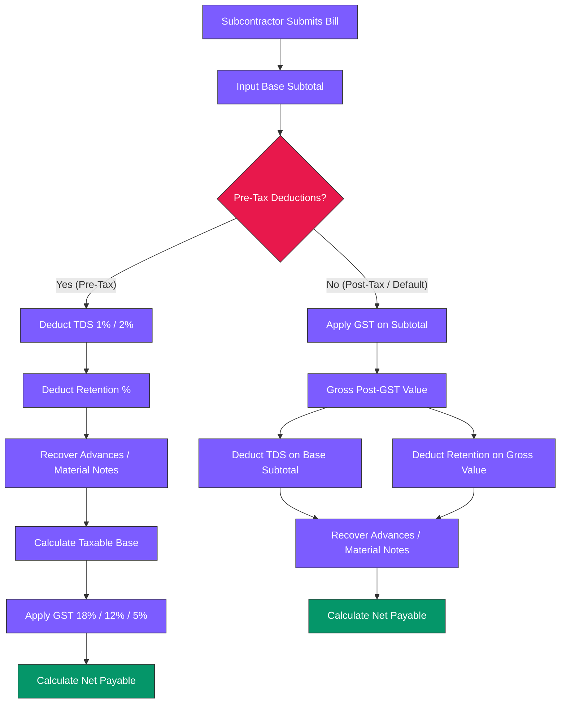
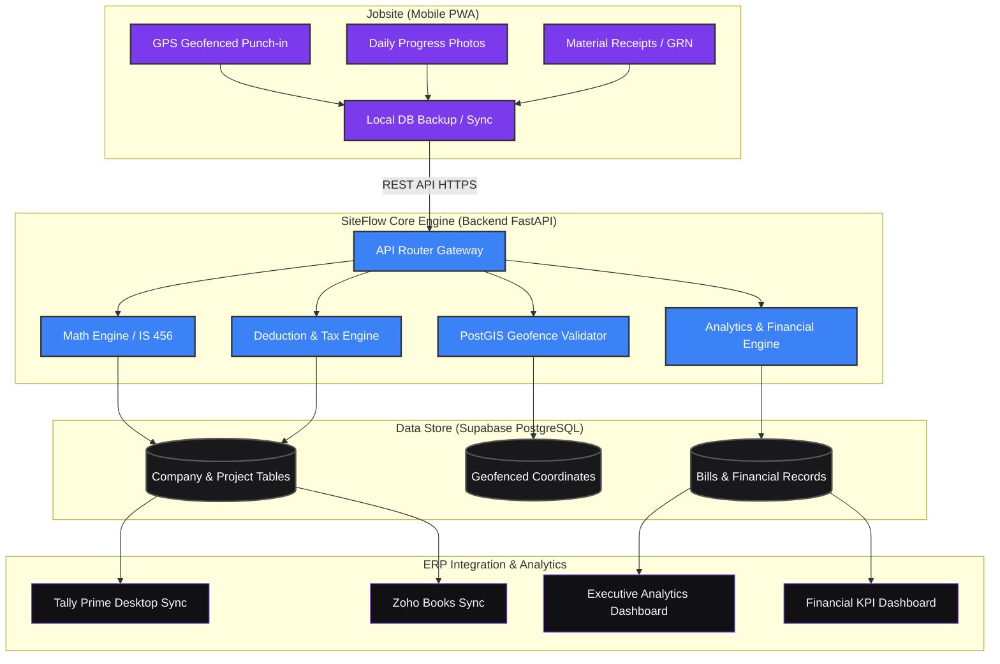

<p align="center">
  
</p>

<p align="center">
  <a href="https://github.com/yieldchaser/siteflow-erp/blob/main/LICENSE"></a>
  <a href="https://siteflow-erp.vercel.app"></a>
  <a href="https://construction-erp-backend-73vm.onrender.com"></a>
  
  
</p>

<p align="center"><em>SiteFlow is the premium, enterprise-grade Construction Management ERP designed specifically for developers, builders, contractors, and project management consultancies.</em></p>

---

## Overview

SiteFlow is an outcome-driven, high-fidelity ERP workspace tailored to the Indian construction industry. It consolidates scattered Excel sheets, manual site registers, and geofenced field operations into a single real-time structured canvas — delivering absolute control over engineering BOQ spreadsheets, subcontractor RA billing math, CPWD-compliant material estimation, purchase-order workflows, and executive schedule timelines. It integrates directly with Tally Prime and Zoho Books ledger cards to automate back-office reconciliation.

Built mobile-first with a GPS-geofenced attendance PWA and an installable offline queue, SiteFlow keeps the field and the office on the same source of truth — from the first site punch to the final client invoice.

---

## Key Features

### Core Platform
- **📊 Dual-Mode Company Dashboard**: Operational and Financial tabs with live KPI cards, SVG trend charts, expense distribution, and project-level summary tables.
- **🔀 25-Type Chart Switcher**: Every dashboard chart supports instant switching between Bar, Pie, Donut, Line, Smooth Line, Area, Scatter, Heatmap, Table, and more.
- **🚀 Guided Onboarding Wizard**: 2-step stepper modal for project creation — collects project details and assigns team members before go-live.
- **🏢 Multi-Branch Settings**: Company profile, branch management, approval workflow rules, and geofence enforcement toggles.
- **🔒 Multi-Tenant Data Isolation**: Row-level security, company-scoped unique keys, and strict data division between tenants.

### Field Operations
- **📍 Geofenced Mobile PWA Attendance**: GPS punch-in/out with Haversine validation, offline local storage backup, and multi-language support (English, Hinglish, Hindi, Tamil).
- **⏱️ Daily Activity & Timesheet Logger**: Start/stop time tracking, reactive duration calculations, WBS task links, remarks, and file attachments.
- **📋 CRM & Quotations**: Lead management, kanban-style pipeline, client contact registry, and full quotation lifecycle (Draft → Sent → Accepted/Rejected).
- **📅 WBS Gantt Timelines**: Forward-pass Critical Path Method (CPM) scheduler with early/late starts, finishes, total float, and circular dependency protection.
- **📐 Drawings & RFI**: Version-controlled blueprint registry with revision locking, pin-based RFI/Clash/Observation overlay, and approval workflows.
- **📱 Progressive Web App**: Installable shell with offline queue for punches and sync log.

### Finance & Compliance
- **🧮 Subcontractor RA Billing**: Real-time invoice calculators with pre-tax/post-tax deduction priorities, automatic Indian GST and TDS presets (Section 194C, 194Q), and debit/credit note ledgers.
- **💰 Finance & Cashbook**: Payment recording, ledger entries, P&L statements, bank account management, and payment request workflows.
- **🛡️ Live Payment & Voucher Approval Gate**: Automatically routes recorded entries to a pending approval workspace. Executives can audit transaction receipts, verify ledger alignments, and approve vouchers with a single click.
- **📑 14 Competitor Transaction Forms**: Internal Transfer, Credit/Debit Notes, Party-to-Party Payment, Equipment Expense, Material Transfer, Sub-Con Workorders, and more.
- **📋 Statutory Reports**: PF, ESI, BOCW (with dynamic 1% cess calculation on total wages), TDS, Professional Tax, and Income Tax monthly return filing with contribution tracking and acknowledgment numbers.
- **📉 Asset Depreciation**: Straight-line, reducing balance, and written-down-value depreciation schedules with monthly ledger entries.
- **🔗 3-Way Matching**: Automated PO-GRN-Invoice reconciliation with variance detection and approve/reject workflow.
- **♻️ Material Wastage**: Scrap, offcut, damage, expiry, and theft tracking with value estimation, reason logging, and photo attachments.
- **💬 Site Chat & MOM**: Project-level group chat with text, media, and voice notes, plus a standalone Minutes of Meeting (MOM) module with list/create/edit/delete and filters.
- **🧩 Custom Fields Engine**: Dynamic field definitions for projects, tasks, bills, invoices, leads, and vendors.

### HR & Payroll
- **🧑‍💼 Employee Directory**: Site staff and office staff management with designation, department, and mobile tracking.
- **📅 Leave Management**: Leave request, approval/rejection workflows, and leave type configuration.
- **🧾 Payroll Runs**: Monthly payroll processing with Basic, HRA, Allowances, PF (employee + employer), ESI, and TDS calculations.
- **😊 Face Recognition Attendance**: Face verification audit trail with confidence scores, geofence validation, and image logging.
- **🏖️ Company Holiday Calendar**: Official company holiday list that automatically credits attendance and resolves salary run offsets.

### Quality & Safety
- **✅ Quality Inspections**: IS-code checklist library, site inspections, non-conformance reports (NCR), and material lab test logs.
- **🦺 Safety Management**: Site hazard reporting, PPE audit checklists, and toolbox talk logs.

### Analytics & Reporting
- **📈 Executive Analytics**: Interactive S-curve progress charts and budget burn charts with hover tooltips.
- **📑 Client Progress Reports**: Auto-generated progress reports with approval workflow and PDF download.
- **📊 Production Tracking**: Interactive recipe builder and batch modal overlays. Supports concrete mix ratio setups (with dry volume 1.54 mix design factor), active batch status tracking, completed batch auto-deductions from warehouse inventories, and low-stock alerts.
- **🗃️ 15-Category Reports Dashboard**: Dynamic, company-wide reports directory spanning Sales, Payments, Progress & Task, Purchase, Party Balances, Tax, and Assets.
- **📅 Daily Progress Report (DPR)**: Comprehensive dashboard aggregating To-Dos, material indents, tasks, shifts, aggregate receipts, and active machinery usage schedules.

### Integrations
- **🔗 Tally Prime**: Direct XML sync gateway for voucher push and pull.
- **☁️ Zoho Books**: Client-side REST API configuration for ledger synchronization.
- **📦 Planned Integrations**: WhatsApp Business, Google Drive, QuickBooks.

---

## 🧮 Indian Construction Engineering & Tax Engine

SiteFlow embeds standardized civil engineering codes, CPWD specifications, and Indian statutory tax rules within its calculation core.

### Concrete Mix & Material Estimation (IS 456:2000)
To convert wet concrete volume into raw material quantities, SiteFlow applies a dry volume conversion factor of **1.54** to account for void ratios and mixing shrinkage:

$$\text{Dry Volume} = \text{Wet Volume} \times 1.54$$

Quantification breaks down cement, sand, and coarse aggregates using CPWD-compliant mix ratios:
* **M5 (1:5:10)** | **M7.5 (1:4:8)** | **M10 (1:3:6)** | **M15 (1:2:4)** | **M20 (1:1.5:3)** | **M25 (1:1:2)**

$$\text{Cement (bags)} = \frac{\text{Dry Volume} \times \text{Cement Ratio}}{\text{Sum of Mix Ratios} \times 0.0347 \text{ m}^3\text{/bag}}$$
$$\text{Sand Volume } (m^3) = \frac{\text{Dry Volume} \times \text{Sand Ratio}}{\text{Sum of Mix Ratios}}$$
$$\text{Coarse Aggregate Volume } (m^3) = \frac{\text{Dry Volume} \times \text{Coarse Aggregate Ratio}}{\text{Sum of Mix Ratios}}$$

### TMT Rebar Weight Calculations (IS 1786)
Reinforcement steel rebar weight is calculated using standard nominal diameters according to the Indian Standard unit weight formula:

$$w = \frac{d^2}{162.2} \text{ kg/m}$$

*Where $d$ is the rebar diameter in millimeters.*

Total reinforcement requirements (incorporating lap length and waste multipliers) are calculated as:

$$W_{\text{total}} = \sum \left( L_i \times N_i \times \frac{d_i^2}{162.2} \right) \times (1 + \text{Wastage Pct})$$

### Subcontractor Billing Tax Deduction Engine
SiteFlow computes subcontractor Running Account (RA) bills according to two distinct prioritization structures depending on contract terms:


```mermaid
flowchart TD
    Start[Subcontractor Submits Bill] --> Input[Input Base Subtotal]
    Choice{Pre-Tax Deductions?}
    Input --> Choice

    Choice -- Yes (Pre-Tax) --> PreTDS[Deduct TDS 1% / 2%]
    PreTDS --> PreRet[Deduct Retention %]
    PreRet --> PreAdv[Recover Advances / Material Notes]
    PreAdv --> PreTaxable[Calculate Taxable Base]
    PreTaxable --> PreGST[Apply GST 18% / 12% / 5%]
    PreGST --> NetPayablePre[Calculate Net Payable]

    Choice -- No (Post-Tax / Default) --> PostGST[Apply GST on Subtotal]
    PostGST --> PostGross[Gross Post-GST Value]
    PostGross --> PostTDS[Deduct TDS on Base Subtotal]
    PostGross --> PostRet[Deduct Retention on Gross Value]
    PostTDS & PostRet --> PostAdv[Recover Advances / Material Notes]
    PostAdv --> NetPayablePost[Calculate Net Payable]

    classDef action fill:#7C5CFF,stroke:#333,color:#fff;
    classDef choice fill:#E8184C,stroke:#333,color:#fff;
    classDef output fill:#059669,stroke:#333,color:#fff;

    class Start,Input,PreTDS,PreRet,PreAdv,PreTaxable,PreGST,PostGST,PostGross,PostTDS,PostRet,PostAdv action;
    class Choice choice;
    class NetPayablePre,NetPayablePost output;
```

#### Pre-Tax Deductions (TDS & Retention on Base)
TDS and security retentions are subtracted *before* applying GST (applicable when subcontractor materials are offset):
1. **TDS Withholding**: $\text{TDS} = S \times \text{TDS Pct}$ (e.g. Section 194C 1% or 2%).
2. **Retention Money**: $\text{Retention} = S \times \text{Retention Pct}$.
3. **Net Taxable Base**: $TB = S - \text{TDS} - \text{Retention} - A$ (where $A$ is the advance recovery).
4. **GST Amount**: $\text{GST} = TB \times \text{GST Pct}$ (Works Contract 18%).
5. **Net Payable**: $\text{Net Payable} = TB + \text{GST}$.

#### Post-Tax Deductions (Standard Works Contract)
GST is applied directly to the base subtotal, and deductions are subtracted from the gross total:
1. **GST Amount**: $\text{GST} = S \times \text{GST Pct}$.
2. **Gross Bill Total**: $G = S + \text{GST}$.
3. **TDS Withholding**: $\text{TDS} = S \times \text{TDS Pct}$.
4. **Retention Money**: $\text{Retention} = G \times \text{Retention Pct}$.
5. **Net Payable**: $\text{Net Payable} = G - \text{TDS} - \text{Retention} - A$.

### Planning & Scheduling Critical Path Method (CPM)
Task timelines calculate network floats to isolate schedule risks:
* **Early Finish (EF):** $\text{EF} = \text{Early Start (ES)} + \text{Duration}$
* **Late Start (LS):** $\text{LS} = \text{Late Finish (LF)} - \text{Duration}$
* **Total Float (TF):** $\text{TF} = \text{LF} - \text{EF} = \text{LS} - \text{ES}$

*Tasks with $\text{Total Float} = 0$ represent the Critical Path; any delay to these tasks directly impacts the project completion date.*

### Brick & Block Masonry Quantity Estimator (CPWD)
* **Modular brick size**: $190 \times 90 \times 90\text{ mm}$ (Nominal size with mortar: $200 \times 100 \times 100\text{ mm}$).
* **Standard brick constant**: $500\text{ bricks per } m^3$ of masonry wall.
* **Dry Mortar volume factor**: $1.33$ (shrinkage & joint waste multiplier).
* **Mortar wet volume fraction**: Typically $30\%$ of total wall masonry volume.

$$\text{Total Brick Count } (N) = \text{Wall Length} \times \text{Wall Height} \times \text{Wall Thickness} \times 500$$
$$V_{\text{dry}} = (\text{Wall Length} \times \text{Wall Height} \times \text{Wall Thickness}) \times 0.30 \times 1.33$$
$$\text{Cement (bags)} = \frac{V_{\text{dry}} \times \text{Cement Ratio}}{\text{Sum of Mix Ratios} \times 0.0347}$$
$$\text{Sand Volume } (m^3) = \frac{V_{\text{dry}} \times \text{Sand Ratio}}{\text{Sum of Mix Ratios}}$$

### Paint & Wall Coverage Quantification
$$\text{Paint Volume (liters)} = \frac{\text{Wall Surface Area} \times \text{Number of Coats}}{\text{Single Coat Coverage Rate} \times \text{Absorption Factor}}$$

### Geofenced Site Labor Shift & Attendance Payroll Math
* **Haversine Distance**: $d \le R_{\text{geofence}}$ is verified.
* **Shift Multipliers**: Standard shift fractions ($0.25, 0.50, 0.75, 1.00, 1.25$ shifts).

$$\text{Daily Labor Compensation} = (\text{Daily Wage} \times \text{Shift Multiplier}) + (\text{Overtime Hours} \times \text{Hourly OT Rate}) + \text{Allowances} - \text{Deductions}$$

### Heavy Equipment Fuel Consumption & Utilization Math
$$R_{\text{fuel}} = \frac{\text{Fuel Consumed (liters)}}{\text{Final Run Hours} - \text{Initial Run Hours}}$$
$$\text{Utilization Pct} = \frac{\text{Working Hours}}{\text{Total Available Shift Hours}} \times 100$$

### Compressive Cube Strength Compliance (IS 516 / IS 456)
$$f_c = \frac{\text{Peak Failure Load (N)}}{\text{Cube Area } (150 \times 150 \text{ mm}^2)} = \frac{P}{22500}$$
* **7-Day Compliance Check**: Compressive strength $f_c \ge 0.65 \times f_{ck}$.
* **28-Day Compliance Check**: Compressive strength $f_c \ge 1.00 \times f_{ck}$.

---

## 🎨 Premium UI/UX & Design Philosophy

SiteFlow features a state-of-the-art **flat canvas** with full support for light and dark modes:
* **Dark Theme Specs**:
  - **Background Canvas**: `#111113` (Warm charcoal-black)
  - **Card Containers**: `#19191C` with borders of `rgba(255, 255, 255, 0.07)`
  - **Active Highlights**: `#7C3AED` (Interactive violet for active indicators, hover items, and primary CTAs)
* **Light Theme Specs**:
  - **Background Canvas**: `#F9FAFB` (Warm off-white porcelain slate)
  - **Card Containers**: `#FFFFFF` with borders of `rgba(0, 0, 0, 0.08)`
  - **Sidebar Navigation**: `#FFFFFF` (Clean white sidebar)
* **Styled WebKit Scrollbars**: Replaces raw browser sliders with a custom `6px` rounded scrollbar thumb.
* **Typography**: Clean, editorial-style **Inter** font with tight letter spacing for high data readability.

---

## 📂 Project Structure

```
siteflow-erp/
├── frontend/                 # Next.js (App Router) frontend + PWA shell
├── backend/                  # FastAPI backend (routers, models, calculators)
│   └── tests/                # Integration & phase test suites
├── supabase/                 # SQL migrations for production PostgreSQL
├── onsiteteams-recon/        # Competitor research artifacts & recon scripts
├── context/                  # Roadmap history, audits, and engineering notes
└── static/                   # Generated report artifacts
```

---

## 🏗 System Architecture & Data Flow

SiteFlow maps jobsite inputs (materials, attendance, progress photos) directly to core calculation engines and accounting records:


```mermaid
graph TD
    subgraph Jobsite ["Jobsite (Mobile PWA)"]
        A1[GPS Geofenced Punch-in] --> B1[Local DB Backup / Sync]
        A2[Daily Progress Photos] --> B1
        A3[Material Receipts / GRN] --> B1
    end

    subgraph CoreEngine ["SiteFlow Core Engine (Backend FastAPI)"]
        B1 -- REST API HTTPS --> C1[API Router Gateway]
        C1 --> C2[Math Engine / IS 456]
        C1 --> C3[Deduction & Tax Engine]
        C1 --> C4[PostGIS Geofence Validator]
        C1 --> C5[Analytics & Financial Engine]
    end

    subgraph DataStore ["Data Store (Supabase PostgreSQL)"]
        C2 --> D1[(Company & Project Tables)]
        C3 --> D1
        C4 --> D2[(Geofenced Coordinates)]
        C5 --> D3[(Bills & Financial Records)]
    end

    subgraph ERP ["ERP Integration & Analytics"]
        D1 --> E1[Tally Prime Desktop Sync]
        D1 --> E2[Zoho Books Sync]
        D3 --> E3[Executive Analytics Dashboard]
        D3 --> E4[Financial KPI Dashboard]
    end

    classDef site fill:#7C3AED,stroke:#333,stroke-width:2px,color:#fff;
    classDef core fill:#3B82F6,stroke:#333,stroke-width:2px,color:#fff;
    classDef db fill:#19191C,stroke:#555,stroke-width:2px,color:#fff;
    classDef integrations fill:#111113,stroke:#7C3AED,stroke-width:1px,color:#F3F4F6;

    class A1,A2,A3,B1 site;
    class C1,C2,C3,C4,C5 core;
    class D1,D2,D3 db;
    class E1,E2,E3,E4 integrations;
```

---

## 🔒 Multi-Tenant Data Security & Isolation

SiteFlow is built from the ground up for strict multi-tenant isolation:
* **Direct Company Linkage**: All transactional tables carry `company_id` columns with foreign keys referencing `companies(id) ON DELETE CASCADE`.
* **Company-Scoped Unique Keys**: Numbers like PO, GRN, and Indents are unique *only within the company context* (`UNIQUE(company_id, po_number)`), permitting standard sequence numbering (e.g. `PO-001`) to coexist across separate tenants.
* **Client Invoice Integrity**: Unique partial indices are enforced on outgoing client tax invoices to prevent duplicate numbers:
  ```sql
  CREATE UNIQUE INDEX unique_sale_invoice_number_per_company
  ON bills (company_id, invoice_number)
  WHERE invoice_type = 'sale';
  ```
* **Human-Readable Namespace Slugs**: Supports clean URLs (e.g., `/c/demo-construction`) rather than raw database UUIDs. A transparent client-side fetch interceptor resolves and maps these slugs on-the-fly to strict `uuid.UUID` primary keys, keeping URLs beautiful while maintaining structural integrity.

---

## 🚀 Technology Stack

| Layer | Technology |
|-------|-----------|
| **Frontend** | Next.js 16 (App Router), React 19, TypeScript, Tailwind CSS |
| **Backend** | FastAPI (Python 3.12), SQLAlchemy 2.0, Pydantic v2 |
| **Database** | Supabase PostgreSQL (production), SQLite (local dev) |
| **Deployment** | Vercel (frontend), Render (backend) |
| **PWA** | Service Worker, offline queue, geolocation API |
| **Charts** | Pure SVG (no external charting library) |
| **Authentication** | JWT-based with company-scoped tokens |

---

## 🛠 Getting Started

### Prerequisites
- **Node.js** 18+ and **npm**
- **Python** 3.12+
- A **Supabase** project (production) **or** a local **SQLite** file (development)

### 1. Backend (FastAPI)

```bash
cd backend
python -m venv .venv
source .venv/bin/activate          # Windows: .venv\Scripts\activate
pip install -r requirements.txt
```

Create a `.env` file in the `backend/` directory (copy from `.env.example`):

```ini
# Database — use SQLite for local dev, Supabase PostgreSQL for production
DATABASE_URL=sqlite:///./test.db

# JWT authentication
SECRET_KEY=replace-with-openssl-rand-hex-32
ALGORITHM=HS256
ACCESS_TOKEN_EXPIRE_MINUTES=1440

# CORS — comma-separated list of allowed frontend origins
FRONTEND_URL=http://localhost:3000
```

Run the API:

```bash
uvicorn app.main:app --host 0.0.0.0 --port 8000 --reload
```

The interactive OpenAPI docs are available at `http://localhost:8000/docs`.

### 2. Frontend (Next.js)

```bash
cd frontend
npm install
```

Create a `.env.local` file in the `frontend/` directory:

```ini
# Backend API origin the browser will call
NEXT_PUBLIC_API_URL=http://localhost:8000
```

> **Note on host resolution:** In development the app calls `http://localhost:8000`; when deployed to a non-local hostname it calls the hosted Render API. Ensure the backend's `FRONTEND_URL` includes the frontend's production origin so CORS requests are permitted.

Run the dev server:

```bash
npm run dev
```

The app is served at `http://localhost:3000`.

### 3. Production Build

```bash
# Frontend
cd frontend && npm run build && npm run start

# Backend (example process manager)
cd backend && pip install -r requirements.txt
FRONTEND_URL=https://your-frontend.vercel.app uvicorn app.main:app --host 0.0.0.0 --port 8000
```

Apply the Supabase SQL migrations from `supabase/` for production data modeling.

---

## 📡 API Reference

The backend exposes a versioned REST API under `/apis/v3/`. Key endpoint groups:

| Module | Base Path |
|--------|-----------|
| **Planning & Gantt** | `/apis/v3/planning/*` |
| **Procurement** | `/apis/v3/procurement/indents`, `/pos`, `/grns`, `/inventory` |
| **Billing** | `/apis/v3/billing/work-orders`, `/bills`, `/bills/summary` |
| **HR** | `/apis/v3/hr/employees`, `/attendance`, `/leaves`, `/timesheets`, `/payroll` |
| **Finance** | `/apis/v3/finance/payments`, `/payment-requests`, `/ledger`, `/pl` |
| **Quality** | `/apis/v3/quality/checklists`, `/inspections`, `/ncr`, `/material-tests` |
| **Reports** | `/apis/v3/reports/{project_id}`, `/generate/{project_id}`, `/approve` |
| **Drawings** | `/apis/v3/drawings`, `/revisions`, `/pins` |
| **Equipment** | `/apis/v3/equipment` |
| **Safety** | `/apis/v3/safety/*` |
| **Analytics** | `/apis/v3/analytics/company/{id}/operational`, `/financial` |
| **Tally Sync** | `/apis/v3/tally/sync`, `/connections` |
| **Settings** | `/apis/v3/settings/company/{id}` |

Full OpenAPI schema available at: `https://construction-erp-backend-73vm.onrender.com/openapi.json`

---

## 🙋 Frequently Asked Questions (FAQ)

**Q: Which Indian standard codes are embedded in the calculation core?**
SiteFlow integrates **IS 456:2000** for concrete grade material quantification and **IS 1786** for reinforcement rebar unit weight calculations. For concrete testing compliance, compressive checks are performed against **IS 516** limits.

**Q: How does the system compute Works Contract GST and TDS deductions?**
Auditors can switch between pre-tax and post-tax deduction priorities inside the RA bill creator. Preset buttons apply GST rules (18% for Work Contracts, 12% for Infrastructure, 5% for Housing) and TDS parameters (1% Section 194C Individual, 2% Section 194C Corporate, 0.1% Section 194Q for purchases of goods).

**Q: How is attendance geofenced and verified for offsite workers?**
Attendance logs are validated using the Haversine formula to compute the distance between the mobile device's GPS coordinates and the pre-configured project center coordinate. Punch-ins exceeding the geofence radius are flagged as offsite. Offline local storage caching allows site labor to punch in even during network dropouts, syncing once connectivity is restored.

**Q: What accounting systems can SiteFlow sync with?**
Out-of-the-box integrations exist for **Tally Prime** (via local XML sync gateway) and **Zoho Books** (via client-side REST API configurations).

**Q: How does the Financial Dashboard get its data?**
The `/apis/v3/analytics/company/{id}/financial` endpoint aggregates from the Bills ledger using `invoice_type` — `sale` for revenue, `purchase` for costs, `subcon` for subcontractor expenses — giving real-time KPIs, monthly trends, and per-project breakdowns without any manual entry.

**Q: How does the chart type switcher work?**
Each dashboard chart subscribes to the same aggregated dataset and re-renders using a pure-SVG renderer selected by the switcher, supporting 25 chart types without any external charting dependency.

---

## 📄 License

SiteFlow is released under the [MIT License](LICENSE).
