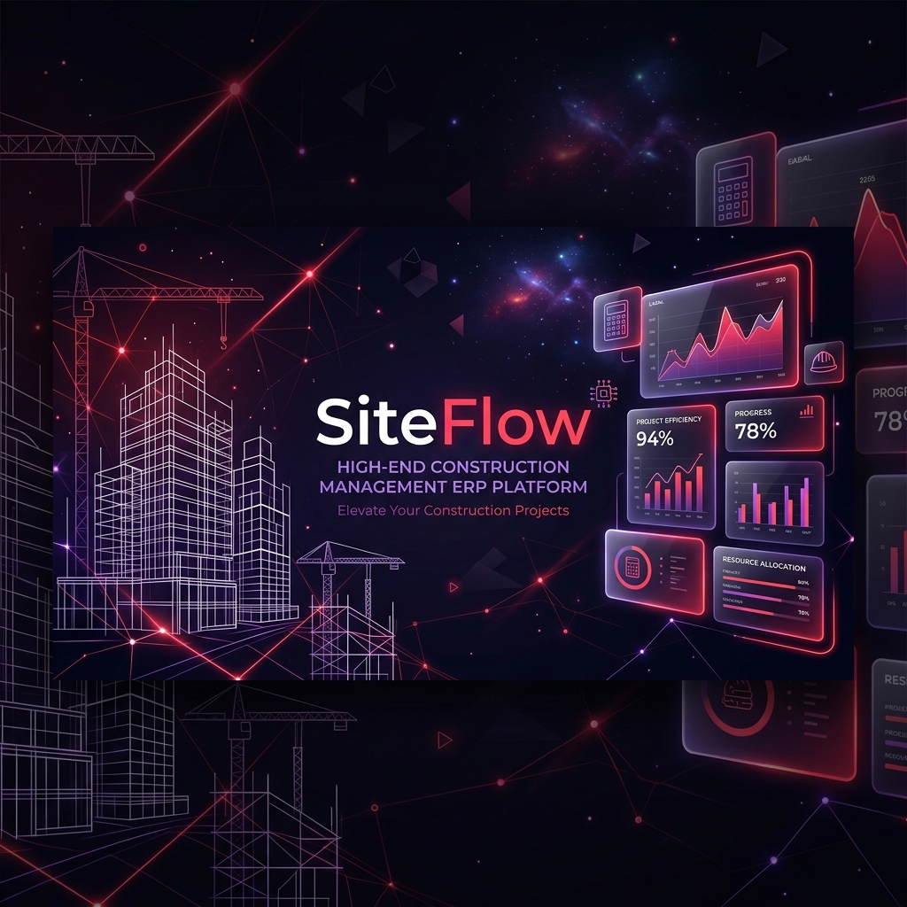
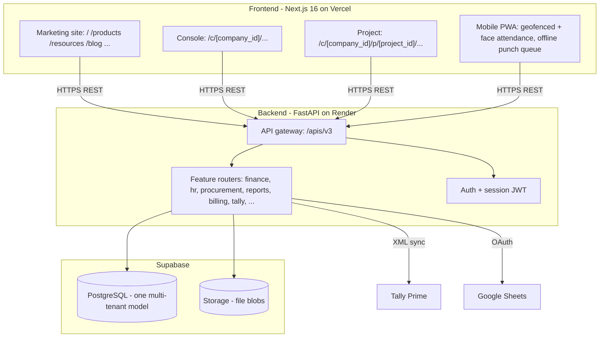
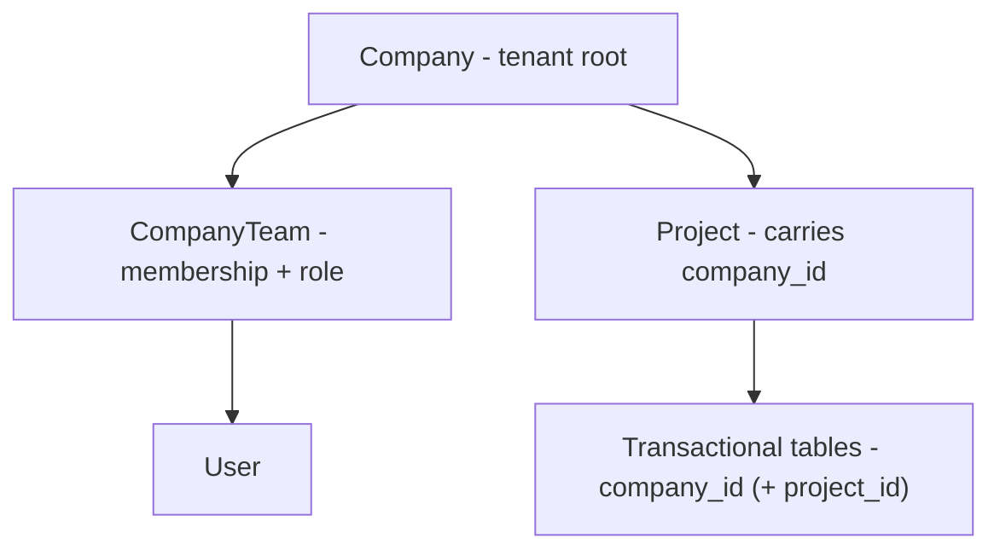
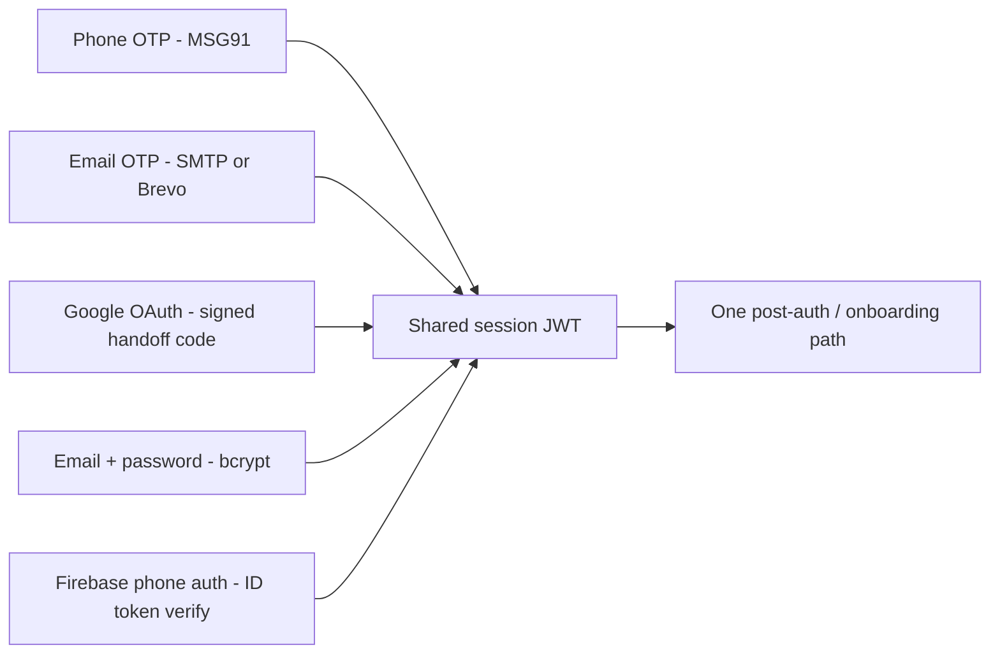

<p align="center">
  
</p>

<p align="center">
  <a href="./LICENSE"></a>
  <a href="https://site-flow-omega.vercel.app"></a>
  <a href="https://construction-erp-backend-73vm.onrender.com"></a>
  
  
  
  
</p>

<p align="center"><em>A construction management ERP for builders, contractors, subcontractors, and project management consultancies in India and the Gulf.</em></p>

---

# SiteFlow

SiteFlow connects the office and the site: BOQ and budgets, task scheduling, procurement, subcontractor running-account billing, finance and cashbook, HR and payroll, quality and safety, equipment, production, and executive reporting all run on one multi-tenant data model. The field side is a mobile-first PWA with GPS-geofenced and face-recognised attendance, so site activity feeds cost and progress in real time.

This repository is the application source. It is not a marketing site generator: the marketing pages live inside the same Next.js app, but they are content, not the product.

## 🚀 Live deployments

| Surface | URL |
| --- | --- |
| Frontend (console + marketing) | https://site-flow-omega.vercel.app |
| Backend API | https://construction-erp-backend-73vm.onrender.com |

The API is versioned under `/apis/v3`. Both URLs above were checked directly and return 200. The older `siteflow-erp.vercel.app` domain referenced in earlier docs no longer resolves (returns 404) and is not the current production frontend.

## 🧱 Tech stack

| Layer | Technology |
| --- | --- |
| Frontend | Next.js 16.2.9 (App Router), React 19.2.4, TypeScript 5, Tailwind CSS v4 |
| Frontend auth SDK | firebase 11.10.0 (browser-side phone auth) |
| Backend | FastAPI (Python 3.12), Uvicorn, SQLAlchemy 2.0, Pydantic v2 (pydantic-settings) |
| Auth/crypto | python-jose (JWT), passlib + bcrypt, firebase-admin (token verify) |
| Data | Supabase PostgreSQL in production, SQLite for local dev (same models) |
| Docs/imports | openpyxl (BOQ Excel import), slowapi (rate limiting on sensitive routes) |
| Observability | sentry-sdk (optional backend error reporting) |

Versions are read from `frontend/package.json` and `backend/requirements.txt`. They are minimums where ranges are specified (for example `fastapi>=0.110.0`).

## 🏗️ Architecture

The repo is a monorepo with two independent packages (no workspace linker at the root):

```
siteflow/
├── frontend/                 # Next.js 16 app: console + marketing site + PWA shell
├── backend/                  # FastAPI app (app/) + tests + scripts + requirements.txt
├── supabase/
│   └── migrations/           # Hand-authored, additive SQL migrations (no ORM tool)
├── onsiteteams-recon/        # Competitor research artifacts (NOT product code)
├── context/                  # Audit notes, verification scripts, engineering history
└── static/                   # Generated report artifacts
```

The deployment topology and request flow:


```mermaid
graph TD
    subgraph Client["Frontend - Next.js 16 on Vercel"]
        MKT["Marketing site: / /products /resources /blog ..."]
        CON["Console: /c/[company_id]/..."]
        PRJ["Project: /c/[company_id]/p/[project_id]/..."]
        PWA["Mobile PWA: geofenced + face attendance, offline punch queue"]
    end

    subgraph API["Backend - FastAPI on Render"]
        GW["API gateway: /apis/v3"]
        RT["Feature routers: finance, hr, procurement, reports, billing, tally, ..."]
        AU["Auth + session JWT"]
        GW --> RT
        GW --> AU
    end

    subgraph Store["Supabase"]
        DB[("PostgreSQL - one multi-tenant model")]
        BLOB[("Storage - file blobs")]
    end

    MKT -->|HTTPS REST| GW
    CON -->|HTTPS REST| GW
    PRJ -->|HTTPS REST| GW
    PWA -->|HTTPS REST| GW
    RT --> DB
    RT --> BLOB
    RT -->|XML sync| TALLY["Tally Prime"]
    RT -->|OAuth| GS["Google Sheets"]
```

### Multi-tenant model

`Company` is the tenant root. A `User` joins a company through a `CompanyTeam` membership row (with a role), so data is isolated per company. Transactional tables carry a `company_id` (and usually a `project_id`) and enforce company-scoped uniqueness where numbering matters (for example `UNIQUE(company_id, po_number)`). The frontend resolves a human-readable company slug to the UUID primary key.


```mermaid
graph TD
    Company["Company - tenant root"] --> Team["CompanyTeam - membership + role"]
    Team --> User["User"]
    Company --> Project["Project - carries company_id"]
    Project --> Txn["Transactional tables - company_id (+ project_id)"]
```

### Console vs marketing site

The console lives under scoped routes:

- `/c/[company_id]/...` for company-level modules (dashboard, finance, HR, procurement, reports, settings, enterprise switching)
- `/c/[company_id]/p/[project_id]/...` for project-scoped modules (tasks, BOQ, drawings, quality, safety, equipment, production)

The public marketing site is served from the root routes (`/`, `/products`, `/blog`, `/resources`, `/integrations`, `/SiteFlow-pricing`, `/about`, `/contact`, `/help`, `/terms`, `/privacy`).

### Theming

Dark is the default. The light theme is toggled by adding a `light-theme` class to `<html>` (persisted in `localStorage`), implemented in `components/ThemeToggle.tsx`. All colors are CSS custom properties in `frontend/src/app/globals.css`:

- Dark: background `#111113`, card `#19191C`, border `rgba(255,255,255,0.07)`, primary `#7C3AED`
- Light: background `#F3F4F6`, card `#FFFFFF`, primary `#6D28D9`

## 🔐 Authentication

All login methods funnel into one shared session JWT and one post-auth/onboarding path:


```mermaid
graph LR
    P["Phone OTP - MSG91"] --> S
    E["Email OTP - SMTP or Brevo"] --> S
    G["Google OAuth - signed handoff code"] --> S
    PW["Email + password - bcrypt"] --> S
    F["Firebase phone auth - ID token verify"] --> S
    S["Shared session JWT"] --> O["One post-auth / onboarding path"]
```

- Phone OTP (MSG91) with HMAC-hashed, TTL-bound, single-use codes
- Email OTP (SMTP or Brevo HTTPS API) using the same hardened OTP machinery
- Google OAuth (identity scopes), exchanged via a one-time signed handoff code
- Email + password (bcrypt hashed)
- Firebase phone auth (additive; the backend verifies the Firebase ID token and mints its own session)

When no SMS/email provider is configured, only a demo allowlist can log in; everyone else gets a clear 503. The app refuses to start in a non-local environment without a strong `SECRET_KEY`.

## 📦 Feature inventory

Derived from the backend routers and the frontend page tree, not from prior docs.

### 🏗️ Project and execution
- Projects, company/project dashboards (financial and operational views)
- Task scheduler with hierarchical tasks, dependencies, and Critical Path Method floats
- Gantt, list, and resources views; S-curve progress
- BOQ import (Excel) and budgeting with cost-code allocation
- Drawings: versioned revisions, pin-based RFI/clash/observation markups, approval workflow
- Daily Progress Report (DPR), team schedule, todos, towers, project files

### 📦 Procurement and inventory
- Material indents, purchase orders (with approval workflow), goods receipt notes
- Warehouse inventory and material transactions
- Three-way PO/GRN/invoice matching
- RFQ and vendor performance scoring

### 💰 Billing, finance, and compliance
- Subcontractor work orders and RA bills with TDS/retention deductions (pre-tax and post-tax paths)
- Debit and credit notes
- Finance payments, cashbook, ledger, project P&L
- Payment and voucher approval gate
- Tally Prime sync (`/apis/v3/tally`) and ZATCA e-invoice generation (`/bills/{id}/zatca`)
- Statutory reports (PF, ESI, BOCW cess, TDS, professional tax) via the statutory router

### 🧑‍💼 Subcontractor and labour
- Subcontractor attendance, performance, and scorecards
- Staff employees, geofenced attendance (Haversine), face recognition, weekly timesheets
- Payroll runs (PF/ESI/TDS), leave management

### ✅ Quality, safety, equipment, production
- Quality checklists (IS-code library), site inspections, NCR, material/lab tests
- Safety incidents, toolbox talks, PPE compliance, LTIF rate
- Equipment fleet registry, fuel burn, maintenance
- Production recipes, batches, material consumption, and variance tracking

### 📈 CRM, library, and reporting
- CRM leads, quotations, RFQ
- Library: parties, materials, cost codes
- Company and project analytics (operational + financial S-curve, burn rate)
- Reports directory (sales, payments, progress, purchase, party balances, tax, assets)
- Client progress reports with PDF export
- Minutes of meeting, site chat, custom fields

### 🔧 Cross-cutting
- Multi-company switching (`CompanySwitcher`), branches, roles, approval rules, payroll settings, company terms, company file assets
- Pure inline-SVG charts with a built-in chart-type switcher (bar, line, area, smooth, pie, donut, scatter, funnel, heatmap/grid, sunburst/rose, stacked, grouped, table) on the company dashboard
- Installable PWA with a service worker (`public/sw.js`) and offline punch queue
- Integrations: Tally Prime and Google Sheets are implemented as backend routers. Zoho Books is referenced in marketing copy but no corresponding backend router was found in this review (treat as not-yet-implemented or verify separately).

## ⚙️ Getting started

Prerequisites: Node.js 18+ and npm, Python 3.12+, and either a Supabase project (production) or a local SQLite file (development).

### Backend

```bash
cd backend
python -m venv .venv
source .venv/bin/activate        # Windows: .venv\Scripts\activate
pip install -r requirements.txt
cp ../.env.example .env           # then edit (see Environment variables below)
uvicorn app.main:app --host 0.0.0.0 --port 8000 --reload
```

The OpenAPI docs are at `http://localhost:8000/docs`. On first run, SQLAlchemy `create_all` builds the SQLite schema (`test.db`). To load demo data (this deletes any existing `test.db`):

```bash
python scripts/seed_demo_data.py
```

### Frontend

```bash
cd frontend
npm install
cp .env.local.example .env.local   # or create one; see Environment variables below
npm run dev
```

The app runs at `http://localhost:3000`.

### Local dev vs production data

Local development uses SQLite (`DATABASE_URL=sqlite:///./test.db`). Production uses Supabase PostgreSQL (`DATABASE_URL=postgresql://...`). The models adapt the UUID type per dialect (a `SQLiteUUID` shim avoids a known SQLite float-read bug), so the same code runs on both.

## 🔑 Environment variables

Copy `.env.example` to `.env` for the backend. Frontend variables are build-time (`NEXT_PUBLIC_*`).

### Backend (read by `app/config.py` unless noted)

| Variable | Required? | Purpose / fallback when unset |
| --- | --- | --- |
| `ENVIRONMENT` | No (default `local`) | Set to `production` on Render. Outside local values, `SECRET_KEY` becomes mandatory. |
| `DATABASE_URL` | Yes | `sqlite:///./test.db` in dev; Supabase Postgres in prod. |
| `SECRET_KEY` | Yes in prod | JWT signing key. App refuses to start with a weak/known key outside local env. |
| `ALGORITHM` | No | `HS256`. |
| `ACCESS_TOKEN_EXPIRE_MINUTES` | No | `1440` (24h). |
| `SMS_PROVIDER` / `SMS_PROVIDER_API_KEY` | Optional | MSG91 phone OTP. Empty key disables real SMS; only demo allowlist logs in (503 otherwise). |
| `MSG91_SENDER_ID` / `MSG91_OTP_TEMPLATE_ID` | Optional | MSG91 template config. |
| `OTP_TTL_SECONDS` / `OTP_MAX_ATTEMPTS` | No | `300` / `5`. |
| `OTP_DEMO_ALLOWLIST` / `OTP_DEMO_CODE` | No | Demo phone numbers + code for local/dev only. |
| `BREVO_API_KEY` | Optional | Email OTP via Brevo HTTPS API (preferred over SMTP on blocked ports). |
| `SMTP_HOST` / `SMTP_PORT` / `SMTP_USER` / `SMTP_PASSWORD` / `SMTP_FROM` / `SMTP_USE_TLS` | Optional | Email OTP via SMTP. |
| `EMAIL_OTP_DEMO_ALLOWLIST` | No | Demo emails allowed to log in without SMTP. |
| `PASSWORD_MIN_LENGTH` | No | `8`. |
| `GOOGLE_LOGIN_CLIENT_ID` / `GOOGLE_LOGIN_CLIENT_SECRET` | Optional | Google login; falls back to the Sheets credentials if unset. |
| `FIREBASE_SERVICE_ACCOUNT_JSON` / `FIREBASE_SERVICE_ACCOUNT_PATH` | Optional | Firebase phone auth; `/auth/firebase/verify` returns 503 if both empty. |
| `FRONTEND_ORIGIN_REGEX` | No | CORS allow-regex for this project's Vercel preview deploys. |
| `FRONTEND_URL` | Optional | Comma-separated explicit prod frontend origins (read directly in `main.py`). |
| `SUPABASE_URL` / `SUPABASE_SERVICE_ROLE_KEY` | Optional | File blobs move to Supabase Storage; otherwise stored in the DB `data` column. |
| `SENTRY_DSN` | Optional | Backend error reporting; cleanly skipped when empty. |
| `GOOGLE_SHEETS_CLIENT_ID` / `GOOGLE_SHEETS_CLIENT_SECRET` | Optional | Google Sheets integration OAuth. |
| `TOKEN_ENCRYPTION_KEY` | Optional | Fernet (base64) key that encrypts Google Sheets OAuth tokens at rest in `GoogleSheetsConnection`; connections created while it is unset store plaintext tokens. |
| `BACKEND_PUBLIC_URL` / `FRONTEND_PUBLIC_URL` | Optional | OAuth redirect bases; fall back to request/frontend origins. |
| `ADMIN_MIGRATION_SECRET` | Optional | One-off admin migrations (for example file backfill); routes reject with 403 when empty. |

### Frontend (Next.js build-time)

| Variable | Required? | Purpose |
| --- | --- | --- |
| `NEXT_PUBLIC_API_URL` | Optional | Used by the PWA bootstrap. The main API client resolves the host at runtime: `localhost:8000` in dev, the Render backend URL in production. |
| `NEXT_PUBLIC_FIREBASE_API_KEY` / `NEXT_PUBLIC_FIREBASE_AUTH_DOMAIN` / `NEXT_PUBLIC_FIREBASE_PROJECT_ID` / `NEXT_PUBLIC_FIREBASE_APP_ID` | Optional | Firebase phone auth in the browser. |

## 🗄️ Database and migrations

`supabase/migrations/` holds hand-authored, additive SQL migrations. There is no ORM migration tool (no Alembic). In local dev the schema is created from the models via `Base.metadata.create_all`. In production, apply the migration SQL to the Supabase database (via the Supabase SQL editor or your migration workflow). New migrations should be additive and backward-compatible; do not drop or rename columns in place without a backfill plan.

## ☁️ Deployment

- Frontend: Vercel (Next.js 16). Backend: Render (Uvicorn/FastAPI). Database and file storage: Supabase (Postgres + Storage).
- Vercel and Render are configured to deploy on pushes to `main` (provider dashboards). No infrastructure-as-code manifests are committed in this repo.
- A GitHub Actions workflow (`.github/workflows/keep_alive.yml`) pings the Render backend every 10 minutes. This exists because the Render free/starter tier spins the service down after inactivity; the ping keeps it warm and avoids cold-start delays.

## 🛡️ Security posture

Hardened (verified in code):

- OTP codes are HMAC-SHA256 hashed, TTL-bound, attempt-capped, and single-use; the plaintext is never stored or returned.
- `SECRET_KEY` is mandatory and rejected if it matches a known-leaked dev value outside local environments.
- Passwords are bcrypt-hashed (passlib). Google OAuth uses a one-time signed handoff code; the session JWT is never placed in a redirect URL.
- CORS is scoped (explicit origins plus a Vercel preview regex) in `main.py`.
- Rate limiting is applied per-endpoint via slowapi on sensitive routes (auth/OTP).
- Multi-tenant isolation is enforced on every write endpoint and on tenant-scoped read endpoints via company/project membership guards (`get_company_membership` / `verify_company_access` / `verify_project_access`). Cross-tenant rejection is covered by regression tests in `backend/tests/coverage/test_router_tenant_isolation.py` and `test_finance_tenant_isolation.py`.
- Role-based access control (RBAC): a flat `module:action` permission taxonomy lives in `backend/app/permissions.py`; per-role grants are stored on `CompanyRole.permissions` and enforced with `require_permission(...)` on high-risk actions (`approve`, `payroll:run`, `settings:manage`, `team:manage`, `data:delete`) and on everyday create/update (`<module>:edit`) writes, plus `:view` gating on sensitive financial/payroll reads. Failsafes: `partner` members always pass, and members with no un-migrated role (empty permissions) fail open. A secret-gated backfill (`POST /apis/v3/admin/migrations/backfill-rbac`) seeds the default roles and assigns un-roled members.
- A settings Roles/Team editor in the console (`frontend/src/components/rbac/*`, `PermissionsContext`) lets admins configure role permissions and assign members.
- Pydantic request models validate value ranges at the API boundary (non-negative amounts/quantities, 0–100 percentages).

Known debt / deferred (be honest, not hidden):

- Google Sheets OAuth tokens (access + refresh) are encrypted at rest with Fernet (`backend/app/crypto.py`) using `TOKEN_ENCRYPTION_KEY` before being written to `GoogleSheetsConnection`; legacy connection rows created before the key was configured remain plaintext.
- Security headers (HSTS, X-Frame-Options, X-Content-Type-Options, Referrer-Policy, Permissions-Policy) and the Content-Security-Policy are set in the frontend itself, in `frontend/next.config.ts`'s `headers()` function (not at the hosting edge); the CSP is enforced via the `Content-Security-Policy` header (not Report-Only).
- Multi-language attendance (English, Hinglish, Hindi, Tamil) is real and implemented client-side: translation objects for all four languages exist in `frontend/src/app/c/[company_id]/d/attendance/page.tsx` and the equivalent project-level attendance page.

## 📐 Conventions

Inferred from the codebase and standing project policy:

- Zero fabrication: no invented counts, no "trusted by" claims, no aspirational features described as shipped. Partial or deferred work is labelled as such.
- No em dashes in user-facing copy.
- Migrations are additive-only; schema changes go through `supabase/migrations/`.
- Theme changes use the CSS custom properties in `globals.css`, never hardcoded colors in components.
- New backend modules are routers registered under the `/apis/v3` prefix in `app/main.py`.

## 📄 License

SiteFlow is released under the MIT License. See [LICENSE](LICENSE).
