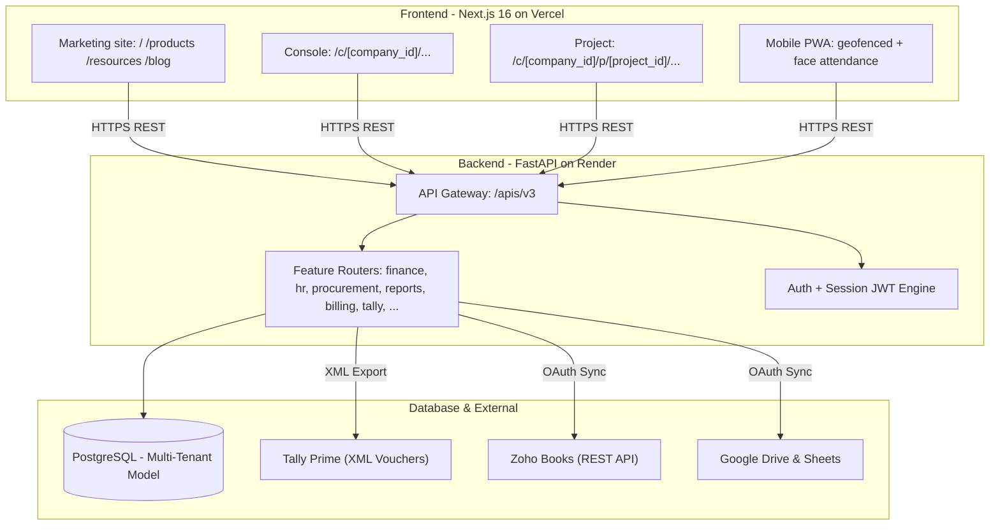

<p align="center">
  
</p>

<p align="center">
  <a href="./LICENSE"></a>
  <a href="https://site-flow-omega.vercel.app"></a>
  <a href="https://construction-erp-backend-73vm.onrender.com"></a>
  
  
  
  
</p>

<p align="center"><em>A construction management ERP for builders, contractors, subcontractors, and project management consultancies in India and the Gulf.</em></p>

---

# SiteFlow

SiteFlow connects the office and the site. BOQ and budgets, task scheduling, procurement, subcontractor running-account billing, finance and cashbook, HR and payroll, quality and safety, equipment, production, and executive reporting all run on one multi-tenant data model. The field side is a mobile-first PWA with GPS-geofenced and face-recognized attendance, so site activity feeds cost and progress in real time.

This repository contains the complete application source, including the Next.js 16 frontend console, public marketing pages, and the FastAPI backend service.

## Live Deployments

| Surface | URL | Status |
| --- | --- | --- |
| Frontend (Console + Marketing) | https://site-flow-omega.vercel.app | Active |
| Backend API Gateway | https://construction-erp-backend-73vm.onrender.com | Active (/apis/v3) |

The API is versioned under `/apis/v3`.

## Tech Stack

| Layer | Technology | Version / Implementation Details |
| --- | --- | --- |
| Frontend Framework | Next.js (App Router) | Next.js 16.2.9, React 19.2.4, TypeScript 5 |
| Styling & Design Tokens | Tailwind CSS | Tailwind CSS v4, Semantic WCAG AA tokens, PageShell layout |
| Frontend Auth SDK | Firebase Auth | Firebase 11.10.0 (Browser-side phone verification) |
| Backend Framework | FastAPI | Python 3.12, Uvicorn, Pydantic v2 (pydantic-settings) |
| ORM & Database | SQLAlchemy | SQLAlchemy 2.0, PostgreSQL (Supabase prod) / SQLite (dev) |
| Auth & Cryptography | Security Libs | python-jose (JWT), passlib + bcrypt, firebase-admin, cryptography (Fernet) |
| Document Processing | Libraries | openpyxl (BOQ Excel import), reportlab / native PDF generators |
| Rate Limiting | slowapi | Per-IP and per-endpoint sliding window limits on sensitive routes |

## Architecture

SiteFlow is structured as a clean monorepo with separated frontend and backend codebases:

```
siteflow/
├── frontend/                 # Next.js 16 app: console, PageShell, marketing, and PWA shell
├── backend/                  # FastAPI app (app/), test suite (tests/coverage), requirements.txt
├── supabase/
│   └── migrations/           # Hand-authored, additive SQL migrations
└── docs/                     # Architectural specs, workflow truth map, audit reports
```

### Request Flow & Topology


```mermaid
graph TD
    subgraph Client["Frontend - Next.js 16 on Vercel"]
        MKT["Marketing site: / /products /resources /blog"]
        CON["Console: /c/[company_id]/..."]
        PRJ["Project: /c/[company_id]/p/[project_id]/..."]
        PWA["Mobile PWA: geofenced + face attendance"]
    end

    subgraph API["Backend - FastAPI on Render"]
        GW["API Gateway: /apis/v3"]
        RT["Feature Routers: finance, hr, procurement, reports, billing, tally, ..."]
        AU["Auth + Session JWT Engine"]
        GW --> RT
        GW --> AU
    end

    subgraph Store["Database & External"]
        DB[("PostgreSQL - Multi-Tenant Model")]
        TALLY["Tally Prime (XML Vouchers)"]
        ZOHO["Zoho Books (REST API)"]
        GDRIVE["Google Drive & Sheets"]
    end

    MKT -->|HTTPS REST| GW
    CON -->|HTTPS REST| GW
    PRJ -->|HTTPS REST| GW
    PWA -->|HTTPS REST| GW
    RT --> DB
    RT -->|XML Export| TALLY
    RT -->|OAuth Sync| ZOHO
    RT -->|OAuth Sync| GDRIVE
```

### Multi-Tenant Data Isolation

`Company` serves as the tenant boundary. Every user account belongs to a company via a `CompanyTeam` membership record specifying roles and permissions. All operational, financial, and inventory tables carry a `company_id` foreign key, ensuring strict query isolation across tenants. Project-specific records additionally link to a `project_id`.

### Navigation Architecture (7 Domain Groups)

The console sidebar organizes application capabilities into 7 clear domain groups:

1. **Planning & Progress**: Dashboard overview, Tasks & Gantt timeline, Daily Progress Reports (DPR), Bill of Quantities (BOQ), and Drawings revision control.
2. **Procurement & Materials**: Material Indents, Purchase Orders (PO), Goods Receipt Notes (GRN), Three-Way Matching, and Warehouse Inventory.
3. **Financial Control**: Client Sale Invoices, Vendor Bills, Payments & Vouchers, Bank Accounts, Cashbook, Budgets, and Retentions / Deductions.
4. **Workforce & Safety**: Employee Directory, GPS Geofenced Attendance, Face Recognition Punching, Labor Muster Roll, Monthly Payroll Runs, Safety Incidents, and Quality Checklists / NCRs.
5. **Plant & Equipment**: Equipment Asset Inventory, Site Deployments & Log Sheets, Fuel Consumption Logging, and Production Batching Recipes.
6. **CRM & Business Development**: Lead Pipeline Kanban, Quotations & Cost Estimations, and Master Rate Card Library.
7. **Reports & Analytics**: 82 Production-Ready Standard Spreadsheet Reports with dynamic multi-column filtering and multi-format export (CSV, PDF, HTML), plus Civil Engineering Quantity Calculators.

### Design System & WCAG AA Tokens

SiteFlow enforces a strict, bevel-free design standard built around the reusable `PageShell` component and semantic CSS tokens:
- **Dark Theme (Default)**: Background `#111113`, Card `#19191C`, Elevated `#222225`, Border `rgba(255,255,255,0.07)`, Primary `#0284C7`.
- **Light Theme**: Background `#F3F4F6`, Card `#FFFFFF`, Elevated `#E5E7EB`, Border `#D1D5DB` (gray-300 for crisp visual hierarchy), Primary `#0369A1`.
- All semantic status tokens (`--success`, `--warning`, `--danger`, `--info`, `--primary`) maintain a minimum contrast ratio of 4.5:1 against surfaces in both themes to guarantee full WCAG AA compliance.

## Authentication & Security

All authentication channels funnel into a unified session JWT engine:
- **Phone OTP**: Verified via MSG91 with single-use, HMAC-SHA256 hashed, TTL-bound OTP codes.
- **Email OTP**: Direct SMTP or Brevo HTTPS API with time-expiring verification hashes.
- **Google OAuth**: Single-use signed handoff code preventing token leakage in query parameters.
- **Email & Password**: Salted bcrypt hashing via passlib.
- **Firebase Phone Auth**: Validated on the backend via Firebase Admin SDK.

Security posture:
- Strict multi-tenant query filtering on all database interactions.
- Granular role-based permissions (`module:action`) enforced at router endpoints.
- Rate-limiting middleware (`slowapi`) on authentication endpoints.
- Fernet encryption for external OAuth tokens stored at rest.

## Getting Started

Prerequisites: Node.js 18+ and npm, Python 3.12+, and Git.

### Backend Setup

```bash
cd backend
python -m venv .venv

# Linux / macOS:
source .venv/bin/activate
# Windows:
.venv\Scripts\activate

pip install -r requirements.txt
cp ../.env.example .env
uvicorn app.main:app --host 0.0.0.0 --port 8000 --reload
```

Interactive OpenAPI documentation is available at `http://localhost:8000/docs`.

### Frontend Setup

```bash
cd frontend
npm install
npm run dev
```

The application will start at `http://localhost:3000`.

### Running Verification Tests

```bash
# Backend Test Suite (Targeted reflection and domain suites):
cd backend
pytest tests/coverage -n 4

# Frontend TypeScript and Production Build:
cd frontend
npx tsc --noEmit
npm run build
```

## Integrations

- **Tally Prime**: Direct XML voucher export for Purchases, Sales, and Payments matching Tally double-entry accounting schemas.
- **Zoho Books**: OAuth synchronization of vendor bills and sales invoices across global regions (.in, .com, .eu).
- **Google Drive & Sheets**: Automated backup of generated documents and payroll run spreadsheets.
- **BI Data Feeds**: Secure API key authenticated REST feeds for Power BI and Tableau ingestion.
- **ZATCA E-Invoicing**: Phase 1 TLV base64 QR generation and UBL 2.1 XML compliance for Saudi operations.

## License

SiteFlow is open-source software licensed under the MIT License. See [LICENSE](LICENSE) for details.
