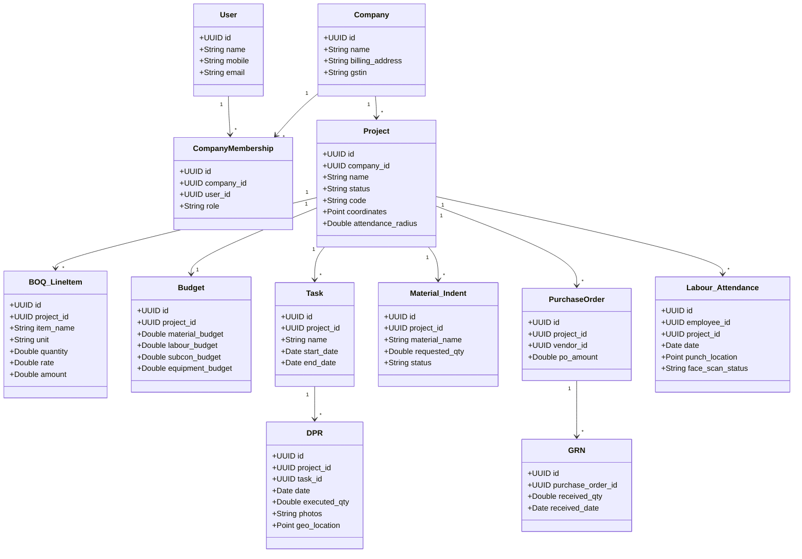

# OnsiteTeams (SiteFlow) — Deep Reconnaissance Report

This report presents the findings of a deep architectural and structural reconnaissance of the repository. The contents of `onsiteteams-FINAL-v5.zip` have been extracted, revealing a complete reverse-engineered payload of **OnsiteTeams (onsiteteams.com)**, a leading Indian Construction ERP SaaS. This package provides the full blueprint required to build a local clone, named **SiteFlow**.

---

## 🗺️ Repository Structure Overview

The repository consists of crawled marketing pages, help documentation, minified Angular production builds, mock API payloads representing a live session, and utility text maps.

```
c:\Users\Dell\Github\Construction-Management-ERP-Software\
├── .code-review-graph/      # Knowledge graph index (currently 0 nodes due to compiled assets)
├── api-responses/           # Main company-level mock API payloads (13 files)
├── api-responses-project/   # Project-level mock API payloads (160 files)
├── help-text/               # Plain-text extracts of 292 help center articles
├── js-chunks/               # 25 lazy-loaded Angular chunk js bundles
├── js-files/                # 7 core Angular javascript files (runtime, main, polyfills)
├── pages/                   # 292 HTML crawled marketing/help pages
├── webapp-pages/            # Entry pages for the web application (index.html, login.html)
├── Recon Pictures/          # 76 high-resolution screenshots of the live system
├── API-MAP-COMPLETE.txt     # Complete discovered REST API endpoints list
├── MASTER-CONTENT.txt       # Combined text content of all crawled help articles (4.2 MB)
├── MASTER-RECON-REPORT.txt  # Detailed reverse-engineered model and UI metadata text
├── all-routes.txt           # Main client-side router entry paths
├── all-urls.txt             # Sitemap index containing 290 crawled marketing/help URLs
├── build_spec.js            # Node docx generator for the full ERP specification
└── zoho-dashboard-data.json # Zoho Analytics dashboard embed HTML page
```

---

## 💻 Front-End Client Analysis

The front-end client is built using **Angular** and contains a production-ready compiled bundle. 

> [!NOTE]
> **Code Knowledge Graph Status**:
> The `code-review-graph` MCP server was successfully run on the repository root. However, because the repository contains **compiled, minified production assets** (specifically the 3.98 MB [main.75768062f516c382.js](file:///c:/Users/Dell/Github/Construction-Management-ERP-Software/js-files/main.75768062f516c382.js) bundle) rather than raw uncompiled TypeScript/JavaScript modules, the parser registered **0 nodes and 0 edges**. The graph index is initialized, but structural call-graph analysis is constrained by the build compilation.

### Key Front-End Files
* **[index.html](file:///c:/Users/Dell/Github/Construction-Management-ERP-Software/webapp-pages/index.html)** & **[login.html](file:///c:/Users/Dell/Github/Construction-Management-ERP-Software/webapp-pages/login.html)**: The main entry points, importing Tailwind CSS variables, Google Fonts (Inter, Roboto), and a custom configuration for `dhtmlx-gantt` (a popular Gantt chart component for construction management).
* **[main.75768062f516c382.js](file:///c:/Users/Dell/Github/Construction-Management-ERP-Software/js-files/main.75768062f516c382.js)**: The core Angular runtime application code containing all forms, page logic, controllers, and API calls.
* **[scripts.e7466094307a85b9.js](file:///c:/Users/Dell/Github/Construction-Management-ERP-Software/js-files/scripts.e7466094307a85b9.js)**: Global vendor libraries (712 KB).
* **[js-chunks/](file:///c:/Users/Dell/Github/Construction-Management-ERP-Software/js-chunks/)**: 25 lazy-loaded chunks representing individual modules (e.g. Subcontractor billing, CRM, Payroll, Material request UI).

---

## 🗄️ Database & Entity Map (Data Model)

Based on the reverse-engineered JS bundle and mock JSON payloads, the following database entity schema represents the core of the Construction ERP. 



---

## 🔌 REST API Design (Discovered Endpoints)

The API relies on the base URL `https://api.onsiteteams.in/apis/v3`. It uses authorization headers: `Authorization: Bearer <JWT>`, `Project-Company-Id: <UUID>`, `Project-Id: <UUID>`, and `Version-Code: 171`.

### Discovered REST Endpoints Table

| Namespace | Endpoint | Method | Query Parameters | Description |
| :--- | :--- | :--- | :--- | :--- |
| **Auth** | `/login` | `POST` | None | Client authentication entry point |
| **Company** | `/list/company` | `GET` | None | Lists companies for logged-in user |
| | `/detail/company/{id}` | `GET` | None | Returns specific company information |
| | `/list/companyuser` | `GET` | `company_id`, `priority_type=[customer\|material_supplier]` | Lists company members or stakeholders |
| | `/list/companybankaccount` | `GET` | `company_id` | Lists registered company bank accounts |
| | `/list/all/project` | `GET` | `company_id` | Lists all active and inactive projects |
| | `/list/mom/project` | `GET` | `company_id` | Minutes of Meeting logs across projects |
| | `/list/todo/project` | `GET` | `company_id` | Active TODOs for the company |
| | `/list/subcategory` | `GET` | `company_id`, `type=[todo\|task\|expense\|material\|attendance]` | Retrieves custom categories |
| **Project** | `/detail/project/{id}` | `GET` | None | Returns metadata for a project |
| | `/dashboard/detail/project/{id}` | `GET` | None | Aggregated project statistics |
| | `/list/attendance` | `GET` | `project_id` | Punch logs for workers on a specific site |
| | `/list/materialstock` | `GET` | `project_id`, `company_id` | Warehouse inventory levels for site |
| | `/list/materialrequest` | `GET` | `project_id` | Material indents requested by site engineers |
| | `/list/purchaseorder` | `GET` | `project_id`, `company_id` | Purchase Orders issued to suppliers |
| | `/list/invoice` | `GET` | `project_id` | Client invoices generated for payment claims |
| | `/list/equipment` | `GET` | `project_id`, `company_id` | Log of active machinery/assets on site |
| | `/list/design` | `GET` | `project_id`, `company_id` | Blueprints, drawing records, and versions |
| | `/list/project/material` | `GET` | `project_id`, `status=[received\|used\|returned\|purchased]` | Material consumption ledger |
| | `/list/all/transaction` | `GET` | `project_id` | Financial ledger (expenses, supplier bills) |
| | `/subcon/list/workorder` | `GET` | `project_id` | Subcontractor Work Orders |
| | `/chart/expense/feature-wise` | `GET` | `project_id` | Expense category chart data |
| | `/chart/weekly/attendace` | `GET` | `project_id` | Weekly workforce strength chart data |

---

## 📈 Recon Findings & Competitive Differentiators

The crawled help-text and marketing folders detail what makes OnsiteTeams highly defensible in the Indian & Middle East markets:

1. **BOQ-to-Bill Enforced Workflow**: Site activities cannot be created without being linked to a line item in the **Bill of Quantities (BOQ)**, preventing unauthorized scope creep.
2. **Three-Way Matching**: Auto-validates: **Purchase Order (PO) Rate** ↔ **GRN (Goods Receipt Note) Quantity** ↔ **Vendor Invoice Bill**, raising alerts on overbilling.
3. **Muster Roll Digitization**: Replaces traditional paper logbooks with GPS-fenced mobile check-ins and facial recognition signatures.
4. **Offline Mobile Support**: Designed for remote, dusty construction environments where internet connectivity is intermittent.
5. **Local Tally & Zoho Sync**: Two-way integration with popular local accounting packages (Tally Prime/ERP, Zoho Books).

---

## 🚀 Recommended Rebuild Roadmap (Next Steps)

For constructing the clone, the following build phases are recommended:

* [ ] **Phase 1: Core Database & Auth**: Create a PostgreSQL database using the schema in Output B, set up multi-tenancy, and implement OTP-based authentication.
* [ ] **Phase 2: Project Shell & BOQ Import**: Build project creation wizards that parse Excel-based BOQs and initialize cost heads.
* [ ] **Phase 3: Material execution (Indent ➔ PO ➔ GRN)**: Standardize the material requesting workflow.
* [ ] **Phase 4: Site Attendance & DPR**: Implement GPS site punch-ins and mobile daily progress reporting.
* [ ] **Phase 5: Financials & Reports**: Formulate RA (Running Account) bills, tax/retention calculations, and exportable PDFs.
