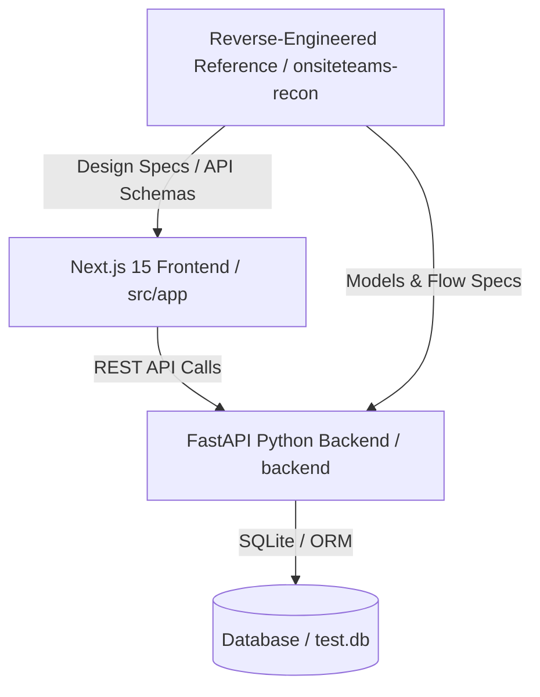
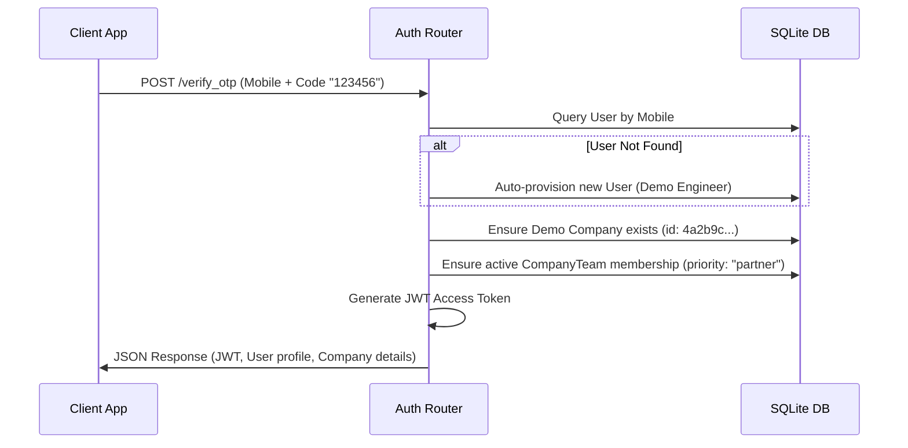

# Repository Analysis: SiteFlow Construction Management ERP

A detailed exploration of the [Construction-Management-ERP-Software](file:///c:/Users/Dell/Github/Construction-Management-ERP-Software) codebase, constructed and updated using the code review knowledge graph.

---

## 📊 Knowledge Graph Statistics

After executing a full rebuild of the repository's structural knowledge graph, we collected the following metrics:

| Metric | Value |
| :--- | :--- |
| **Parsed Files** | 149 |
| **Total Nodes** | 14,033 |
| **Total Edges** | 77,329 |
| **Languages Detected** | Python, SQL, Javascript, Typescript, TSX |
| **Last Index Update** | 2026-07-04 14:52:10 |

### Node Breakdown
- **Functions**: 13,243
- **Classes**: 629
- **Files**: 149
- **Tests**: 12

### Edge Breakdown (Dependency & Structure)
- **Calls**: 60,636
- **Contains**: 14,104
- **References**: 907
- **Tested By**: 688
- **Imports From**: 706
- **Inherits**: 288

---

## 🏛️ Codebase Architecture

The codebase is split into three main areas:

### 1. Backend Service (`backend/app`)
Built on **FastAPI** and **SQLAlchemy (SQLite)**, the backend is highly modular:
- [main.py](file:///c:/Users/Dell/Github/Construction-Management-ERP-Software/backend/app/main.py): Sets up the FastAPI app instance, CORS middleware, and includes all routers.
- [models.py](file:///c:/Users/Dell/Github/Construction-Management-ERP-Software/backend/app/models.py): Defines the database schema covering Companies, Projects, Users, Budgets, Ledger Accounts, Indents, RFQs, Inspections, Incidents, and Equipment.
- **Routers** ([backend/app/routers](file:///c:/Users/Dell/Github/Construction-Management-ERP-Software/backend/app/routers)): Scope-based controllers containing the API business logic.
  - [calculators.py](file:///c:/Users/Dell/Github/Construction-Management-ERP-Software/backend/app/routers/calculators.py): Civil engineering and CPWD-compliant material estimation core.
  - [billing.py](file:///c:/Users/Dell/Github/Construction-Management-ERP-Software/backend/app/routers/billing.py): Subcontractor Works Contract RA billing calculators (Indian GST and TDS parameters).
  - [planning.py](file:///c:/Users/Dell/Github/Construction-Management-ERP-Software/backend/app/routers/planning.py): Forward-pass Critical Path Method (CPM) scheduler with dependency checking.
  - [hr.py](file:///c:/Users/Dell/Github/Construction-Management-ERP-Software/backend/app/routers/hr.py): Timesheets, Payroll runs, geofenced GPS punches.

### 2. Frontend Workspace (`frontend/src`)
A **Next.js 15 (App Router)** single-page application structure featuring:
- **Routing Canvas**: Built around `c/[company_id]` (Company view) and `c/[company_id]/p/[project_id]` (Project view).
- **Modules**: Under each project folder, there are distinct dashboards for 26 functional modules (e.g. `billing`, `procurement`, `drawings`, `equipment`, `face-recognition`, `planning`, `quality`, `safety`, `subcon`, `three-way`).
- **Styles**: Glassmorphic UI aesthetics are maintained via [globals.css](file:///c:/Users/Dell/Github/Construction-Management-ERP-Software/frontend/src/app/globals.css) configured for high-fidelity dark slate backdrops.

### 3. Reconstruction Reference (`onsiteteams-recon`)
A comprehensive reference directory containing:
- Reverse-engineered Angular JS code segments from `onsiteteams.com` (`js-files/`, `js-chunks/`).
- API schemas and patterns (`extracted_api_schemas.txt`, `fully_audited_spec.txt`).
- Help text, sitemaps, and design assets that guide the implementation of SiteFlow's modules.

---

## ⚙️ Technical Highlights

### CPWD mix ratios & IS 456 Concrete Math
In [calculators.py](file:///c:/Users/Dell/Github/Construction-Management-ERP-Software/backend/app/routers/calculators.py#L60-L108), wet concrete volume is converted to raw material requirements using a dry volume factor of **1.54** to account for joint/mixing voids:
- Mixes supported: **M7.5, M10, M15, M20, M25**.
- Cement weight bag conversions and sand/coarse aggregate volumetric requirements are returned dynamically.

### IS 1786 Steel Weight Estimator
TMT steel rebar units are computed utilizing the Indian Standard nominal diameter formula:
$$w = \frac{d^2}{162.89} \text{ kg/m}$$
For columns, a standard lap length addition multiplier is factored in:
$$\text{Lap Length} = 50 \times \text{Rebar Diameter}$$

### OTP Auth & Demo Auto-Provisioning Flow
Tracing the execution flow `verify_otp` in [auth.py](file:///c:/Users/Dell/Github/Construction-Management-ERP-Software/backend/app/routers/auth.py#L56-L121) shows how user registration is simplified:

---

## 🛠️ Recommendations for Next Steps

1. **Verify Backend Functionality**:
   The repository includes a suite of test scripts under `backend/` (`test_api.py`, `test_phase2.py`, etc.). You can run these using `pytest` to verify the API endpoints.
2. **Start Dev Servers**:
   - Backend: Run `uvicorn app.main:app --reload` inside `backend/`
   - Frontend: Run `npm run dev` inside `frontend/`
3. **Inspect the UI**:
   Examine [page.tsx](file:///c:/Users/Dell/Github/Construction-Management-ERP-Software/frontend/src/app/page.tsx) to see the onboarding canvas and module routers.
